# 从零写一个自动化漏洞猎人

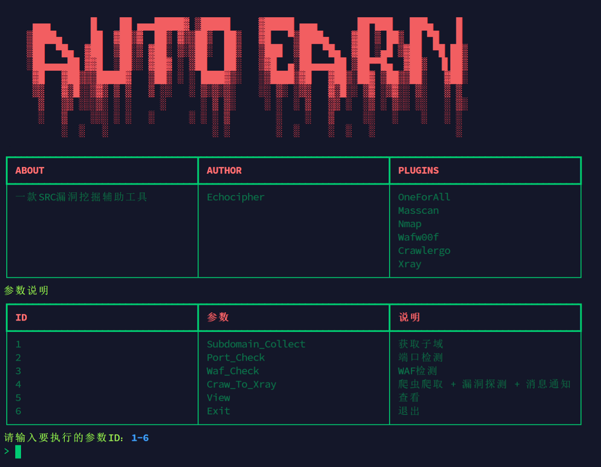

## 关于

Author：DeadEye-Echocipher

Mail：echocipher#163.com

Github：https://github.com/Echocipher/AUTO-EARN

团队公众号：


## 前言

我们打算从零编写一个`自动化`的漏洞`fuzz`工具，用来辅助我们漏洞探测，我更希望它像是一个流程框架，完成的是一个工具间的`联动`过程，不用限制我们在`信息收集`或者`漏洞扫描`中使用工具或者版本，以免因为之后工具更迭，目录结构变化，使得整体框架需要调整，同理，我们也尽量保证不对第三方工具进行很大的改动，本次只是写出一个样例版本，完成基本的自动化过程，每个过程举出一个例子，希望能抛砖引玉，大家可以给自己编写出一个属于自己的`Bug Bounty`利器，我们这次会使用`Python`完成程序的编写过程，在编写整个程序之前，我们需要先构思一下整体流程，我们大致将我们的自动化工具分为三个模块

1. 信息收集
2. 漏洞Fuzz
3. 通知提醒

我们在开始之前先给它取个有趣的名字吧，我们可能会在类似于`众测`等项目中利用到我们的工具，希望目标就是`自动赚钱`，所以我们这里就叫它`Auto Earn`吧

## 框架实现

在我们确认好了我们的模块大致功能为`信息收集`、`Fuzz`以及`通知提醒`之后，我们已经有了一个程序的大致骨架，接下来我们就要开始思考每一部分具体怎么实现了，我们大致思考了整个过程中可能能用到的一些工具以及方法，整理出一个样例版本大致框架如下


这里你完全可以按照自己的喜好来使用自己的工具、脚本、方法来完成自己的一个流程框架

### 信息收集

我们这里子域名收集就使用`精灵`师傅写的[OneForAll](https://github.com/shmilylty/OneForAll)来完成我们的子域名收集过程，端口扫描我们使用了`shodan`的`api`接口以及`硬糖`师傅提到过的`masscan + nmap`的方式，我们可以利用`masscan`扫描端口速度较快的特点进行全端口探测，之后利用`nmap`进行指纹识别，挑选其中的`web`服务从而增加我们可能会找到新的风险点的几率，`waf检测`是我们加的一个样例功能，我们可以在整个自动化流程中按自己需求对目标进行筛选，比如排除带有`waf`的目标就是一个比较不错的选择，这里仅以利用`wafw00f`进行指纹识别为例，之后大家可以按照自己需求进行进一步的处理过程

### Fuzz

`Fuzz`部分我们打算首先利用`0Kee-Team`编写的[crawlergo](https://github.com/0Kee-Team/crawlergo)来进行爬虫爬取，在爬取到相应的链接后我们将它直接连接`被动扫描器`，其中，长亭的[xray](https://github.com/chaitin/xray)以及`w8ay`师傅写的[w13scan](https://github.com/w-digital-scanner/w13scan)都是不错的选择，我们这里以`xray`为例完成这个项目

### 通知提醒

在通知提醒方面，我们选择了[Server酱](http://sc.ftqq.com/)，不仅可以连接微信，而且通知模板支持`markdown`，并且`xray `有一种漏洞输出模式叫 `webhook-output`，在发现漏洞的时候，将会向指定的 `url `通过`post `的方法漏洞数据，我们就可以及时的收到漏洞通知了，还有一个是我们需要考虑到的，就是我们同样需要在本地数据库存一份我们的结果文件，并且以`可视化`的方法进行展示，这样我们就不用担心有可能因为网络不佳等原因导致的我们错过漏洞通知，我们这里利用`flask`以及`sqlite`进行数据存储，并且用[echarts](https://echarts.apache.org/zh/index.html)来定制我们的数据可视化图表从而获得较为直观的展示。

## 开始编写

### 目录结构

再确定好我们的框架之后，我们首先确定我们的目录结构，其中我们的`env`是我们的虚拟环境，其中`autoearn.py`是我们程序的入口文件，`lib`目录用来存放我们之后用来`子域收集`、`端口检测`等插件文件，`logs`用来存放我们之后程序中用到的`工具`等产生的日志文件以方便我们之后查看程序进度、对报错信息进行`Debug`处理，`results`用来存放我们的结果文件，`templates`用来存放我们用于后端的页面文件，`tools`用来存放我们用到的工具文件

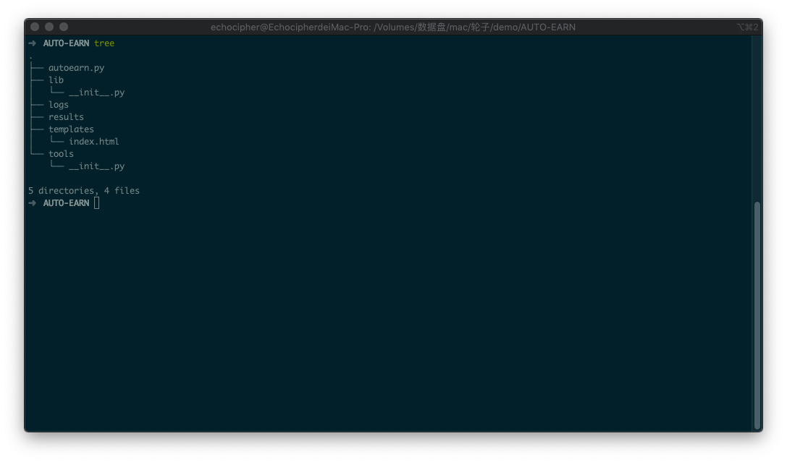

### Banner

在设置好整体框架后我们终于要开始编写我们的程序了，同样的，我们需要给我们的入口程序`autoearn.py`来设置一个框架，之后再向其中填写具体的功能，为了我们整个程序看起来更美观一些，我们可以使用一些字符画生成的网站来生成我们的`BANNER`，比如我们的`AUTOEARN`就可以变成

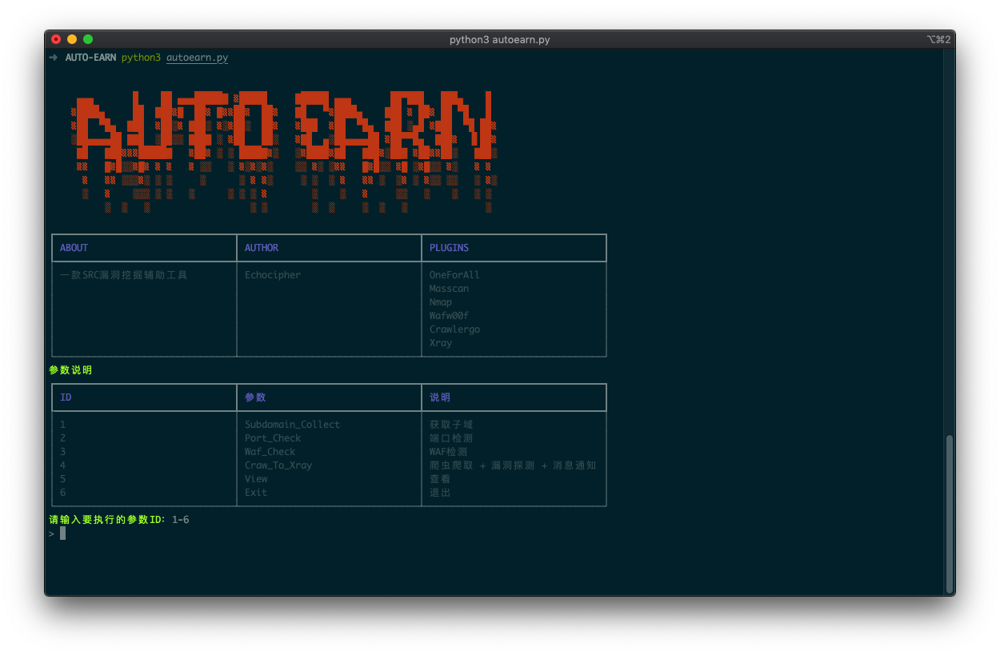

之后我们就可以利用一些字符画生成网站声称我们个性化的`banner`，相关网站地址如下：

1. [patorjk](http://patorjk.com/software/taag/)
2. [network-science](http://www.network-science.de/ascii/)

为了我们的输出也更好看，我们决定不再使用默认的`print`，我们可以利用`rich`库，`Rich`是一个`Python`库，用于在终端中提供丰富的文本和精美的格式，`GitHub`地址：[Rich](https://github.com/willmcgugan/rich)，我们可以利用`pip`方便的进行安装

```bash
pip3 install rich
```

接下来就是配置函数了，我们设置一个`banner`函数，用来输出我们的`banner`信息，`end`函数用来表示程序结束，`main`函数用来执行我们整体程序的执行流程，为了更方便的使用，我们决定仿照`Metasploit`完成一个交互式的程序，因此我们需要为整个过程设计一个输入模式，我这里不想要复杂的命令参数，因此我们只需设定`数字参数`，在接收到相应的`数字参数`后，我们的程序执行相应的命令，我们利用`while True ...`来循环接收参数，完成不同的功能，因此我们在完成上述过程后，`autoearn.py`目前代码结构如下

```python
import sys
import time
from rich.console import Console
from rich.table import Column, Table


console = Console()


# banner生成函数
def banner():
    msg = '''

     ▄▄▄       █    ██ ▄▄▄█████▓ ▒█████     ▓█████ ▄▄▄       ██▀███   ███▄    █    
    ▒████▄     ██  ▓██▒▓  ██▒ ▓▒▒██▒  ██▒   ▓█   ▀▒████▄    ▓██ ▒ ██▒ ██ ▀█   █    
    ▒██  ▀█▄  ▓██  ▒██░▒ ▓██░ ▒░▒██░  ██▒   ▒███  ▒██  ▀█▄  ▓██ ░▄█ ▒▓██  ▀█ ██▒   
    ░██▄▄▄▄██ ▓▓█  ░██░░ ▓██▓ ░ ▒██   ██░   ▒▓█  ▄░██▄▄▄▄██ ▒██▀▀█▄  ▓██▒  ▐▌██▒ 
     ▓█   ▓██▒▒▒█████▓   ▒██▒ ░ ░ ████▓▒░   ░▒████▒▓█   ▓██▒░██▓ ▒██▒▒██░   ▓██░   
     ▒▒   ▓▒█░░▒▓▒ ▒ ▒   ▒ ░░   ░ ▒░▒░▒░    ░░ ▒░ ░▒▒   ▓▒█░░ ▒▓ ░▒▓░░ ▒░   ▒ ▒    
      ▒   ▒▒ ░░░▒░ ░ ░     ░      ░ ▒ ▒░     ░ ░  ░ ▒   ▒▒ ░  ░▒ ░ ▒░░ ░░   ░ ▒░   
      ░   ▒    ░░░ ░ ░   ░      ░ ░ ░ ▒        ░    ░   ▒     ░░   ░    ░   ░ ░    
          ░  ░   ░                  ░ ░        ░  ░     ░  ░   ░              ░  
    '''

    console.print(msg, style="bold red")
    table = Table(show_header=True, header_style="bold magenta")
    table.add_column("ABOUT", style="dim", width=30)
    table.add_column("AUTHOR", style="dim", width=30)
    table.add_column("PLUGINS", style="dim", width=30)
    help_table = Table(show_header=True, header_style="bold magenta")
    help_table.add_column("ID", style="dim", width=30)
    help_table.add_column("参数", style="dim", width=30)
    help_table.add_column("说明", style="dim", width=30)
    table.add_row(
    "一款SRC漏洞挖掘辅助工具",
    "Echocipher",
    "OneForAll"
    )
    table.add_row(
    "",
    "",
    "Masscan"
    )
    table.add_row(
    "",
    "",
    "Nmap"
    )
    table.add_row(
    "",
    "",
    "Wafw00f"
    )
    table.add_row(
    "",
    "",
    "Crawlergo"
    )    
    table.add_row(
    "",
    "",
    "Xray"
    )
    help_table.add_row(
    "1",
    "Subdomain_Collect",
    "获取子域"
    )
    help_table.add_row(
    "2",
    "Port_Check",
    "端口检测"
    )
    help_table.add_row(
    "3",
    "Waf_Check",
    "WAF检测"
    )
    help_table.add_row(
    "4",
    "Craw_To_Xray",
    "爬虫爬取 + 漏洞探测 + 消息通知"
    )
    help_table.add_row(
    "5",
    "View",
    "查看"
    )
    help_table.add_row(
    "6",
    "Exit",
    "退出"
    )
    console.print(table)
    console.print('参数说明', style="#ADFF2F")
    console.print(help_table)


# 结束函数
def end():
    console.print("shutting down at {0}".format(time.strftime("%X")), style="#ADFF2F")


def main():
    banner()
    while True:
        console.print('请输入要执行的参数ID：[bold cyan]1-6[/bold cyan]', style="#ADFF2F")
        args = input('> ')
        if args == '1':
            console.print('这是获取子域函数', style="#ADFF2F")
        elif args == '2':
            console.print('这是端口检测函数', style="#ADFF2F")
        elif args == '3':
            console.print('这是waf检测函数', style="#ADFF2F")
        elif args == '4':
            console.print('这是爬虫+漏洞Fuzz函数', style="#ADFF2F")
        elif args == '5':
            console.print('这是启动可视化页面函数', style="#ADFF2F")
        elif args == '6':
            break
        else:
            console.print('输入参数有误，请检查后输入', style="bold red")
            sys.exit()
    end()


if __name__ == '__main__':
    main()
```

此时，我们已经为我们的脚本设置了一个好看的`banner`

### 目标读取

在设定完`Banner`信息之后，我们接下来为我们的程序完成一个目标读取的功能，我们这里通过一个简单的方法来实现目标的读入，我们在根目录在根目录新建一个`target.txt`作为我们目标的存储文件，读写文件是最常见的`IO`操作。`Python`内置了读写文件的函数，用法和`C`是兼容的，但是大家应该知道，在`Python`中，如果我们利用`open()`函数，我们就要考虑到调用`close()`方法关闭文件。文件使用完毕后必须关闭，因为文件对象会占用操作系统的资源，而且由于文件读写时都有可能产生`IOError`，一旦出错，后面的`f.close()`就不会调用。所以，为了保证无论是否出错都能正确地关闭文件，我们也要利用`try...finally`来实现，这样太麻烦了，所以`Python`引入了`with`语句来自动帮我们调用`close()`方法

```python
with open('/path/to/file', 'r') as f:
    print(f.read())
```

这和前面的`try ... finally`是一样的，但是代码更佳简洁，并且不必调用`f.close()`方法。

因此我们就可以编写我们的第一个`插件`了，我们利用它来读取`target.txt`中的文件，这里我们要注意到其中`\n`可能会带来的影响，我们可以利用 `strip() `方法来移除字符串头尾指定的字符（默认为空格或换行符）或字符序列。

```python
# lib/read_target.py
import sys
from rich.console import Console


console = Console()


# 读取文件函数
def read_target(file):
	url_list = []
	try:
		with open(file,'r') as wr:
			for url in wr.readlines():
				url_list.append(url.strip()) # 把末尾的'\n'删掉
		return url_list
	except:
		console.print('目标文件读取异常，请检查文件是否存在', style="bold red")
		sys.exit()
```

我们这里定义了一个`read_target`函数，它有一个`file`参数，用来指定要读取的文件位置，因为我们如果有其他目标文件不是当前目录的`target.txt`，比如当我们结合其他赏金平台的爬虫脚本时，如果我们爬虫的结果文件过大，我们复制到当前`target.txt`就会是一个比较漫长的过程，最后返回一个`url_list`用来返回我们读取到的内容，我们之后无论进行`子域检测`等过程还是直接进行`漏洞Fuzz`，都可以从这里接收到目标参数，并且加入`try..`来抓取错误，从而应对可能会出现的问题，当我们调用它的时候，它的结果应该如下

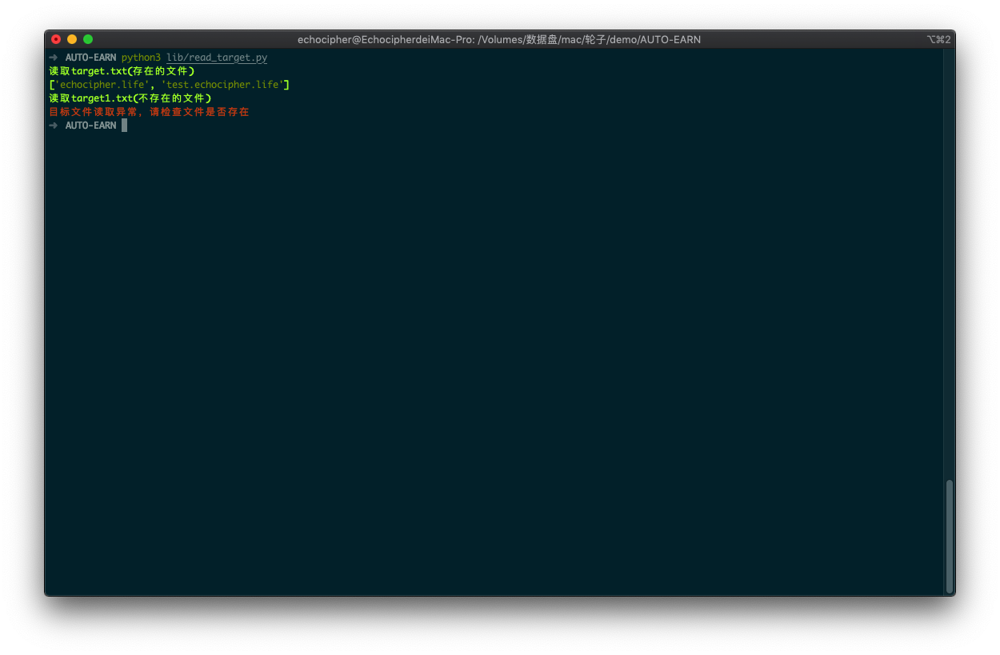

至此，我们的`目标读取`功能已经完成

### 调用其它py文件中的函数

我们上一部分中，我们可以看到我们将`read_target`函数放置到`lib`文件夹中，这是因为我们希望`autoearn.py`完成的是任务调度的功能，而不是将冗长的程序代码放置到同一个`autoearn.py`文件中，这样不仅代码不美观，而且之后修改起来也会十分复杂，那么我们如何调用它其中的函数呢，我们可以使用如下方法来在主函数中调用我们刚才编写的`read_target.py`中的`read_target`函数

```python
from lib.read_target import read_target
```

接下来我们就在`autoearn.py`中调用这一插件，我们这里以`子域收集`为例子，当我们输入`1`时，打印出`target.txt`中的值

```python
# autoearn.py

import sys
import time
from rich.console import Console
from rich.table import Column, Table
from lib.read_target import read_target


console = Console()


# banner生成函数
def banner():
    msg = '''

     ▄▄▄       █    ██ ▄▄▄█████▓ ▒█████     ▓█████ ▄▄▄       ██▀███   ███▄    █    
    ▒████▄     ██  ▓██▒▓  ██▒ ▓▒▒██▒  ██▒   ▓█   ▀▒████▄    ▓██ ▒ ██▒ ██ ▀█   █    
    ▒██  ▀█▄  ▓██  ▒██░▒ ▓██░ ▒░▒██░  ██▒   ▒███  ▒██  ▀█▄  ▓██ ░▄█ ▒▓██  ▀█ ██▒   
    ░██▄▄▄▄██ ▓▓█  ░██░░ ▓██▓ ░ ▒██   ██░   ▒▓█  ▄░██▄▄▄▄██ ▒██▀▀█▄  ▓██▒  ▐▌██▒ 
     ▓█   ▓██▒▒▒█████▓   ▒██▒ ░ ░ ████▓▒░   ░▒████▒▓█   ▓██▒░██▓ ▒██▒▒██░   ▓██░   
     ▒▒   ▓▒█░░▒▓▒ ▒ ▒   ▒ ░░   ░ ▒░▒░▒░    ░░ ▒░ ░▒▒   ▓▒█░░ ▒▓ ░▒▓░░ ▒░   ▒ ▒    
      ▒   ▒▒ ░░░▒░ ░ ░     ░      ░ ▒ ▒░     ░ ░  ░ ▒   ▒▒ ░  ░▒ ░ ▒░░ ░░   ░ ▒░   
      ░   ▒    ░░░ ░ ░   ░      ░ ░ ░ ▒        ░    ░   ▒     ░░   ░    ░   ░ ░    
          ░  ░   ░                  ░ ░        ░  ░     ░  ░   ░              ░  
    '''

    console.print(msg, style="bold red")
    table = Table(show_header=True, header_style="bold magenta")
    table.add_column("ABOUT", style="dim", width=30)
    table.add_column("AUTHOR", style="dim", width=30)
    table.add_column("PLUGINS", style="dim", width=30)
    help_table = Table(show_header=True, header_style="bold magenta")
    help_table.add_column("ID", style="dim", width=30)
    help_table.add_column("参数", style="dim", width=30)
    help_table.add_column("说明", style="dim", width=30)
    table.add_row(
    "一款SRC漏洞挖掘辅助工具",
    "Echocipher",
    "OneForAll"
    )
    table.add_row(
    "",
    "",
    "Masscan"
    )
    table.add_row(
    "",
    "",
    "Nmap"
    )
    table.add_row(
    "",
    "",
    "Wafw00f"
    )
    table.add_row(
    "",
    "",
    "Crawlergo"
    )    
    table.add_row(
    "",
    "",
    "Xray"
    )
    help_table.add_row(
    "1",
    "Subdomain_Collect",
    "获取子域"
    )
    help_table.add_row(
    "2",
    "Port_Check",
    "端口检测"
    )
    help_table.add_row(
    "3",
    "Waf_Check",
    "WAF检测"
    )
    help_table.add_row(
    "4",
    "Craw_To_Xray",
    "爬虫爬取 + 漏洞探测 + 消息通知"
    )
    help_table.add_row(
    "5",
    "View",
    "查看"
    )
    help_table.add_row(
    "6",
    "Exit",
    "退出"
    )
    console.print(table)
    console.print('参数说明', style="#ADFF2F")
    console.print(help_table)


# 结束函数
def end():
    console.print("shutting down at {0}".format(time.strftime("%X")), style="#ADFF2F")


def main():
    banner()
    while True:
        console.print('请输入要执行的参数ID：[bold cyan]1-6[/bold cyan]', style="#ADFF2F")
        args = input('> ')
        if args == '1':
            console.print(read_target('target.txt'), style="#ADFF2F")
        elif args == '2':
            console.print('这是端口检测函数', style="#ADFF2F")
        elif args == '3':
            console.print('这是waf检测函数', style="#ADFF2F")
        elif args == '4':
            console.print('这是爬虫+漏洞Fuzz函数', style="#ADFF2F")
        elif args == '5':
            console.print('这是启动可视化页面函数', style="#ADFF2F")
        elif args == '6':
            break
        else:
            console.print('输入参数有误，请检查后输入', style="bold red")
            sys.exit()
    end()


if __name__ == '__main__':
    main()
```

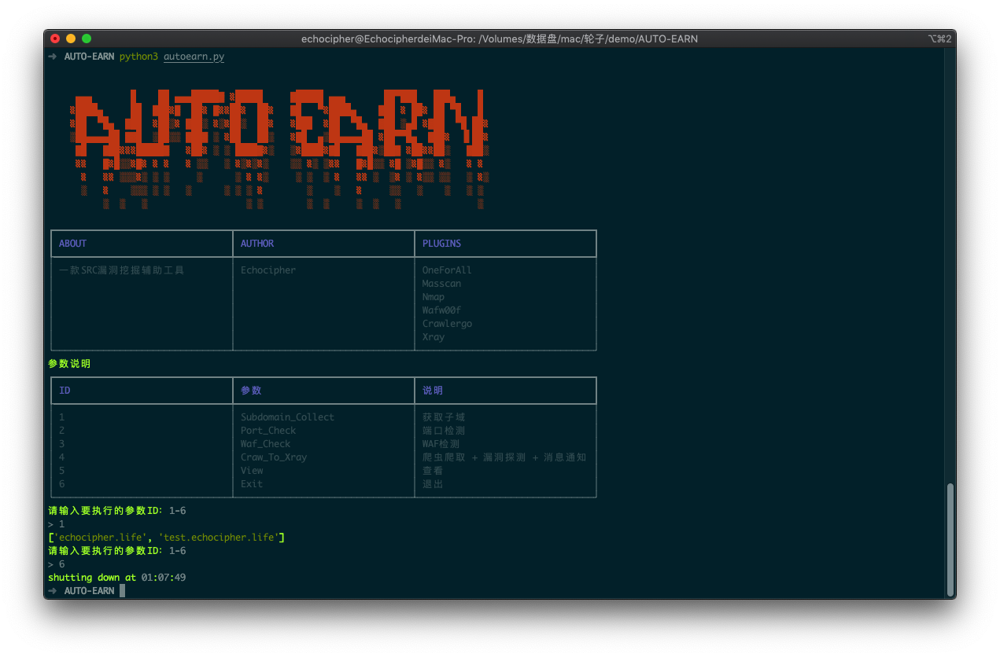

我们可以看到，我们已经成功通过调用`read_target.py`中的`read_target`函数

### 配置文件

我们知道了如何调用其它`py`文件中的函数方法后，我们同样可以调用其它文件中的`参数`，这样我们就可以设定一个`config.py`用来当做我们的配置文件，以后我们想要读取的目标在其他目录时，就不需要打开`autoearn.py`文件一行一行的寻找`target.txt`进行修改，再重新运行了

```python
# lib/target.py

# 目标文件路径
target_path = 'target.txt'
```

接下来我们修改一下`autoearn.py`即可完成调用

```python
# autoearn.py

from lib import config
...
        if args == '1':
            console.print(read_target(config.target_path), style="#ADFF2F")
...
```

### 获取子域

在我们读取到我们的目标之后，我们就可以开始我们信息收集的第一步：获取子域，我们不打算过于限定我们在漏洞探测中利用的工具种类以及方法，你也可以利用自己喜好的方法从`read_target`读取到目标传递给自己的子域收集工具即可，我们这里作为样例利用的是`精灵`师傅写的[OneForAll](https://github.com/shmilylty/OneForAll)，我们只需要我们在`OneForAll`文档中可以看到

```bash
    Example:
        python3 oneforall.py version
        python3 oneforall.py --target example.com run
        python3 oneforall.py --target ./domains.txt run
        python3 oneforall.py --target example.com --valid None run
        python3 oneforall.py --target example.com --brute True run
        python3 oneforall.py --target example.com --port small run
        python3 oneforall.py --target example.com --format csv run
        python3 oneforall.py --target example.com --dns False run
        python3 oneforall.py --target example.com --req False run
        python3 oneforall.py --target example.com --takeover False run
        python3 oneforall.py --target example.com --show True run
```

我们这里可以利用`--target`参数直接跟上我们根目录的`target.txt`来完成我们的子域收集过程，由于我们前面也说了，我们这里不限定于一种子域收集的工具方法，所以我们不打算直接利用`import`的方式调用`oneforall.py`中的函数，而是利用`subprocess`来完成我们的执行系统命令的过程，它允许我们启动一个新进程，并连接到它们的`输入`、`输出`、`错误`管道，从而获取返回值，这样不仅你可以替换成自己喜好的子域收集工具，而且还可以避免之后例如`OneForAll`代码重构、升级造成我们框架本身对一些函数调用失败的情况，我们利用其中的`Popen`方法，`Popen` 是 `subprocess`的核心，子进程的创建和管理都靠它处理。用法如下

```bash
>>> import subprocess
>>> p = subprocess.Popen('ls -l', shell=True)
>>> total 164
-rw-r--r--  1 root root   133 Jul  4 16:25 admin-openrc.sh
-rw-r--r--  1 root root   268 Jul 10 15:55 admin-openrc-v3.sh
...
```

在进行调用之前，我们首先要将`OneForAll`配置到本地

```bash
cd tools/
git clone https://gitee.com/shmilylty/OneForAll.git
cd OneForAll/
python -m pip install -U pip setuptools wheel -i https://mirrors.aliyun.com/pypi/simple/
pip3 install -r requirements.txt -i https://mirrors.aliyun.com/pypi/simple/
python oneforall.py --help
```

具体依赖安装以及对`oneforall`的配置可以查看[OneForAll文档](https://github.com/shmilylty/OneForAll)，这里不做赘述，这里要注意的是OneForAll基于[Python 3.8.0](https://www.python.org/downloads/release/python-380/)开发和测试，请使用高于`Python 3.8.0`的稳定发行版本，其他版本可能会出现一些问题（`Windows`平台必须使用`3.8.0`以上版本），安装`Python`环境可以参考[Python 3 安装指南](https://pythonguidecn.readthedocs.io/zh/latest/starting/installation.html#python-3)。运行以下命令检查`Python`和`pip3`版本：

```bash
python3 -V
pip3 -V
```

如果你看到以下类似输出便说明Python环境没有问题：

```bash
Python 3.8.0
pip 19.2.2 from C:\Users\shmilylty\AppData\Roaming\Python\Python38\site-packages\pip (python 3.8)
```

接下来我们就该想办法调用我们的`OneForAll`了，我们知道，信息收集是一个较为漫长的过程，我们不希望一直卡在程序界面等待程序的完成，我们追求的是一种`异步`的效果，我们只需发出`开始子域收集`的命令，之后系统后台运行即可，这样也避免了因为`shell`的断开连接而程序终止前功尽弃的风险，但是后台运行还有一个需要考虑的事情就是我们需要在我们需要的时候知道当前子域收集的状况，这样也可以及时的看到任务进度以及是否有报错信息，所以我们需要将程序运行结果保存到例如`oneforall.log`日志文件来记录子域收集的日志信息，所以我们确定好任务后就可以编写我们的第二个插件：subdomain_collec.py

```python
# lib/subdomain_collect.py

import subprocess
from lib import config
from rich.console import Console


console = Console()

# 子域收集函数
def oneforall_collect(target):
    cmd = 'nohup python3 ' + config.oneforall_path + ' --target ' + target + ' run > logs/oneforall.log 2>&1 &'
    try:
	    rsp = subprocess.Popen(cmd, stdout=subprocess.PIPE, stderr=subprocess.PIPE, shell=True)
	    console.print('正在后台进行子域收集', style="#ADFF2F")
    except:
        console.print('子域收集失败，请检查输入格式', style="bold red")
```

其中对于`autoearn.py`以及`config.py`的相应修改这里不再赘述，这时我们已经能够通过`oneforall`来进行我们列表中的子域收集过程，并且我们可以通过`tail -f logs/oneforall.log`来动态的监控这一过程


最终结果将会保存在`tools/OneForAll/results`目录下，当然目前是远远不够的，我们需要做的事情还有以下两点

1. 收集完成后消息通知
2. 本地数据库备份

因为我们也说过了，子域收集是一个相对较为漫长的过程，这样我们就可以开启子域收集之后就去忙别的事情了，所以我们需要一个`消息提醒`的功能，以便于我们能及时的进一步的行动，虽然`OneForAll`已经贴心的将我们子域探测的结果放置到了数据库中，通过文档我们可以知道

```
其中类似example_com_origin_result表存放每个模块最初子域收集结果。
其中类似example_com_resolve_result表存放对子域进行解析后的结果。
其中类似example_com_last_result表存放上一次子域收集结果（需要收集两次以上才会生成）。
其中类似example_com_now_result表存放现在子域收集结果，一般情况关注这张表就可以了
```

我们完全可以通过读取数据库来获得我们的子域收集结果，但是如果使用者有其他的脚本、方法来收集子域，这样情况下就不是很适用了，我们开头就说了我们需要一个`耦合度`低，`独立性`强的框架，因此我们这里采取将数据库复制一份到我们自己的数据库中，这样我们就算是使用其他的工具只需要再写一个函数来将子域收集结果放到我们数据库这里即可，这样就可以脱离对于子域收集的结果格式的依赖了，我们首先完成`通知提醒`的功能

### 通知提醒

这里我们利用`Server酱`完成通知提醒的功能，[Server酱](http://sc.ftqq.com/3.version)是一款「程序员」和「服务器」之间的通信软件，就是从服务器推报警和日志到手机的工具，使用过程比较简便

1. 登入：用GitHub账号[登入网站](http://sc.ftqq.com/?c=github&a=login)，就能获得一个[SCKEY](http://sc.ftqq.com/?c=code)（在「[发送消息](http://sc.ftqq.com/?c=code)」页面）
2. 绑定：点击「[微信推送](http://sc.ftqq.com/?c=wechat&a=bind)」，扫码关注同时即可完成绑定
3. 发消息：往 http://sc.ftqq.com/SCKEY.send 发只需要向发一个`GET`或者`POST`请求，就可以在微信里收到消息啦

其他内容可以自行到[Server酱](http://sc.ftqq.com/3.version)查看官方文档

我们首先编写一个`server_push.py`，来测试如何发送一条消息给微信

```python
# lib/server_push.py

import requests
from lib import config
from rich.console import Console


console = Console()


# 子域收集状态提醒
def subdomain_status_push():
    try:
        resp = requests.post(config.sckey,data={"text": "子域收集完成提醒", "desp": '子域收集已经完成'})
    except:
        console.print('子域提醒失败，请检查sckey是否正确配置', style="bold red")
```

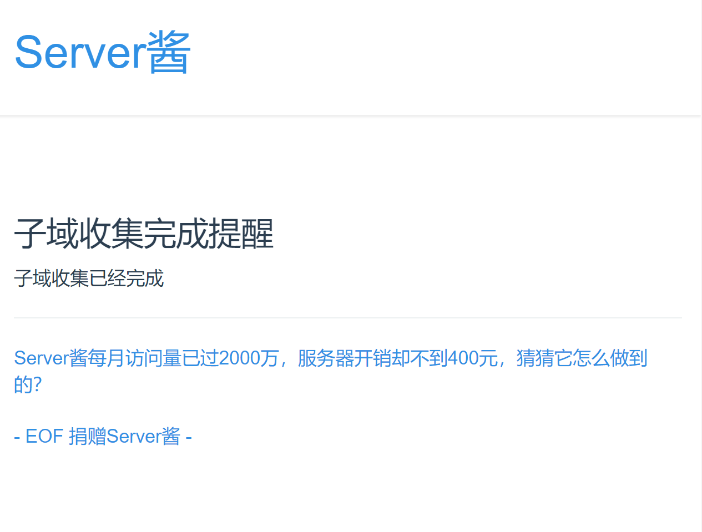

我们已经成功收到了消息通知，接下来就是我们如何知道子域收集已经完成，因为我们已经通过`nohup`让程序生成`oneforall.log`，这里我们只要监控我们的`nohup`即可，我们这里要注意的是不要使用`jobs`命令来获取，因为`jobs`命令只看当前终端生效的，关闭终端后，在另一个终端`jobs`已经无法看到后台跑得程序了，此时利用`ps`（进程查看命令），我们要了解一些参数

```bash
 a:显示所有程序 
 u:以用户为主的格式来显示 
 x:显示所有程序，不以终端机来区分
```

我们可以使用`ps -def | grep`来方便的查找进程，但是最后一行总是会`grep`自己，所以我们要用`grep -v`参数将`grep`命令排除掉，我们再用`awk`提取一下`进程ID`，即可方便的知道程序的状态，比如我们执行子域收集之后我们利用如下命令即可获取`进程ID`

```bash
ps -aux | grep oneforall.py | grep -v grep | awk '{print $2}'
```

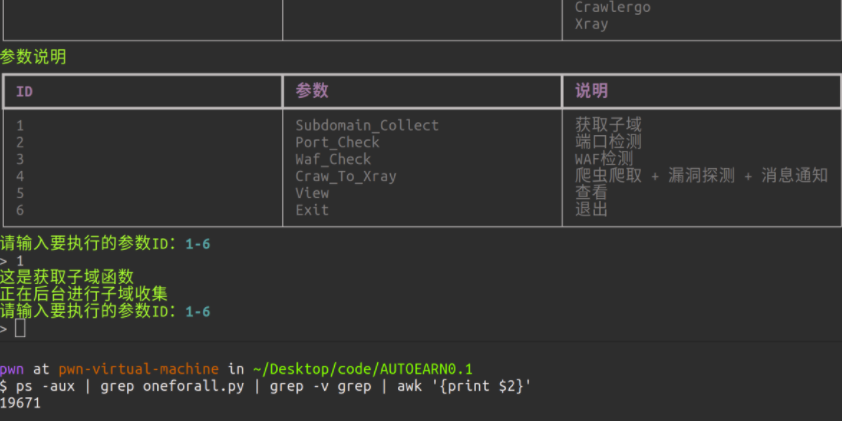

如果任务结束则该进程结束，因此我们只要通过判断是否有该`进程ID`即可判断任务是否完成，我们这里新建一个`su bdomain_monitor.py`，然后让它一直运行，我们通过而每隔`1`分钟判别`rsp.stdout.read()`中输出的内容是否为空来判别任务是否结束（我们也应该把这个时间参数放置到`config.py`从而让用户根据自身任务大小合理设置时间间隔），但是这里有一点需要注意的就是，如果你想简单的通过`rsp.stdout.read()`是否为空来判断任务是否结束则会考虑失误，因为我们在没有开始运行`oneforall.py`的时候，系统中自然也没有这个`进程ID`，`rsp.stdout.read()`就为空，按照我们的逻辑他就会认为是我们的子域收集已经完成，从而一直发送收集完成的消息，因此我们这里需要加一个判断来进行条件筛选，我们通过`while`让他开始如下判断，当它不为`0`的时候才进入循环，休眠`60`秒，再进行判断如果一次，如果这时候已经是`0`了，就代表任务结束了，则发送消息，否则继续，这里要注意的是我们需要定义两个变量来获取进程存在的状态，否则同一个命令，连续输出两次`stdout`，第二次无论任务结束与否输出都为空，例如我们编写如下代码

```python
def test():
    while True:
        cmd = 'ls'
        rsp = subprocess.Popen(cmd, stdout=subprocess.PIPE, stderr=subprocess.PIPE, shell=True)
        print('第一次输出{}'.format(rsp.stdout.read())) 
        print('第二次输出{}'.format(rsp.stdout.read()))     
```

按照我们的想法，只不过是同样的输出调用了两次而已，应该两次输出结果都相同，但是当我们运行的时候我们会发现

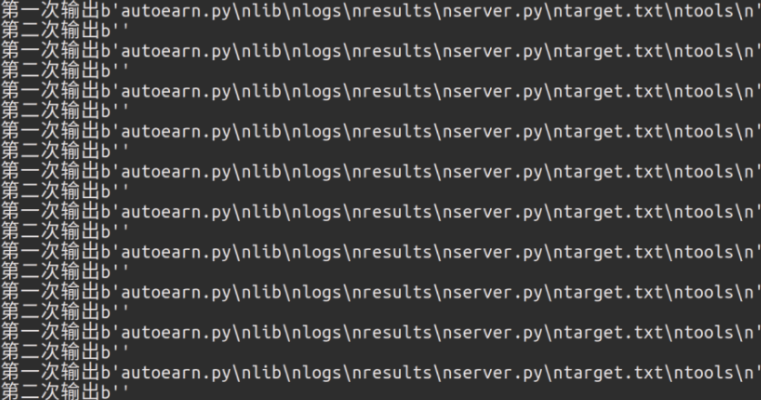

正如我们上面说的，无论任务结束与否，第二次结果都为空，也就是说我们无法使用这种办法判别任务是否结束，也许有的同学说，那我将这个检测函数放到子域收集函数后面调用就好了，无论是流程上还是逻辑上都是这样的，这样就可以忽略刚开始没有进程的时候对我们判别过程的影响，但是这样其实也不是完美的，因为我们一开始就提到了，子域收集是一个漫长的过程，我们如果把这一函数放置到子域收集函数后面也就意味着这个监控函数也要放置到主函数中一起运行，那么我们的主函数就不能因为各种原因停止掉，如果网络错误或者我们需要暂时中断一下终端，那么这个监控函数就随之消失了，所以这不是我们需要的，我们这里可以定义两个变量来获取进程状态

```python
# subdomain_monitor.py

import time
import subprocess
from lib import config, server_push
from rich.console import Console


console = Console()


# 子域监控函数
def subdomain_status_check():
    while True:
        cmd = "ps -aux | grep oneforall.py | grep -v grep | awk '{print $2}'"
        console.log('正在进行子域收集监控')
        start_rsp = subprocess.Popen(cmd, stdout=subprocess.PIPE, stderr=subprocess.PIPE, shell=True)
        time.sleep(config.server_sleep_time)
        end_rsp = subprocess.Popen(cmd, stdout=subprocess.PIPE, stderr=subprocess.PIPE, shell=True)
        if len(start_rsp.stdout.read().strip()) != 0:
            console.log('子域收集中')
            if len(end_rsp.stdout.read().strip()) == 0:
                console.log('子域收集完成')
                break
```

当`start_rsp.stdout.read()`不为空的时候开始进入判断，这里我分别定义了两个变量，`start_rsp`以及`end_rsp`，他们两个之间的间隔即为我们设置的`sleep`，当我们子域这样就不会出现第二次输出无论进程结束没结束都会输出为空的情况了，我们这里要注意输出中也存在之前提到过的`\n`情况，所以要注意用`strip`处理一下，这里大家也应该通过上述程序代码注意到了在逻辑上是任务完成后就`break`跳出循环了，不会再进行监控与数据库操作等后续操作，因此也就是说每次开启`start.sh`仅能完成一次完整的流程，这样设置的考虑主要有以下两个方面（关于`stop.sh`后文会进行详细的解释）

1. `subdomain_monitor.py`需要利用`while True...`来保证完整的进程监控过程，长时间的后台运行会造成一些系统负担
2. 更希望以`项目`为单位进行运转，每次启动的任务就是一个系统，在每次执行完`stop.sh`后会默认以当前日期以`%Y%m%d%H%M%S`的格式进行命名备份，并且会清空`./tools/OneForAll/results`目录中的文件，大家可按需进行调整

因此每次执行流程即为`sh start.sh  -->  python3 autoearn.py  --> sh stop.sh`，否则程序执行的仍然是上次运行的结果，而且子域收集监控无法正常进行以及添加新任务。

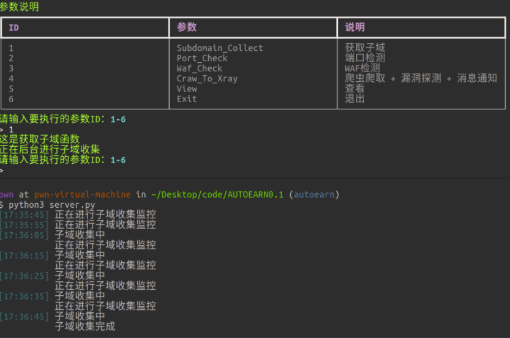

我们可以看到，已经可以进行正常的监控了，接下来我们只要把最后我们调试用的`console.log('子域收集完成')`更换成之前我们写好的`Server酱`推送函数即可

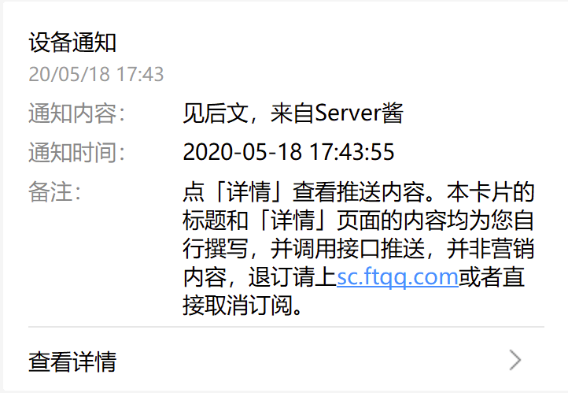

### 数据库备份

接下来我们就是要完成我们本地数据库备份的事情了，为了方便我们选择`sqlite`作为我们的数据库，同样的动手之前我们需要思考一下我们的数据库结构以及相应的函数的编写

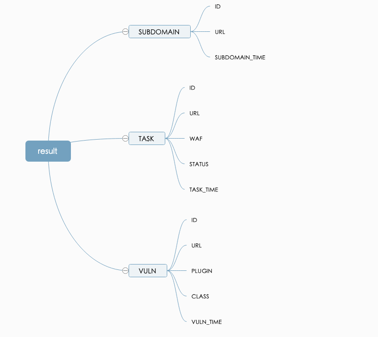

我们设计了一个数据库`results`，然后分别有三个表`SUBDOMAIN`、`TASK`、`VULN`，分别存储`子域收集结果`、`任务结果`、`漏洞结果`，对应字段如下

```
# SUBDMAMIN - 子域名表
ID：自增主键
URL：子域URL
SUBDOMAIN_TIME：子域插入数据表时间
# TASK - 任务表
ID：自增主键
URL：任务URL
TASK_TIME：任务域名插入数据表时间
# VULN - 漏洞表
ID：自增主键
URL：漏洞URL
PLUGIN：Xray漏洞信息字段
CLASS：Xray漏洞信息字段
VULN_TIME：漏洞URL插入数据表时间
```

接下来我们新建一个`sql_connect.py`来存储我们所有与数据库操作有关的函数，我们这里利用`sqlite3`模块来完成我们与数据库的操作，我们要设计好`try...`流程，以便我们能方便的`Debug`，首先我们先配置好我们的数据库文件存储位置`results/result.sqlite3`，我们同样将该路径放置到`config`文件中，以便我们能更简介的看到我们的配置情况

```python
import time
import sqlite3
from lib import config
from rich.console import Console


console = Console()


conn = sqlite3.connect(config.result_sql_path)


# 任务数据表检查
def task_sql_check():
    c = conn.cursor()
    console.print('正在检查任务数据表是否存在，如不存在则自动新建',style="#ADFF2F")
    try:
        c.execute('''CREATE TABLE TASK
            (ID INTEGER PRIMARY KEY ,
            URL           TEXT    NOT NULL,
            BANNER        TEXT    ,
            WAF           TEXT    ,
            STATUS        TEXT    ,
            TASK_TIME     TEXT  );
           ''')
        conn.commit()
    except:
        console.print('任务数据表已存在',style="bold red")


# 子域数据表检查
def subdomain_sql_check():
    c = conn.cursor()
    console.print('正在检查子域数据表是否存在，如不存在则自动新建',style="#ADFF2F")
    try:
        c.execute('''CREATE TABLE SUBDOMAIN
            (ID INTEGER PRIMARY KEY ,
            URL           TEXT    NOT NULL,
            SUBDOMAIN_TIME     TEXT  );
           ''')
        conn.commit()
    except:
        console.print('子域数据表已存在',style="bold red")


# 漏洞数据表检查
def vuln_sql_check():
    c = conn.cursor()
    console.print('正在检查漏洞数据表是否存在，如不存在则自动新建',style="#ADFF2F")
    try:
        c.execute('''CREATE TABLE VULN
            (ID INTEGER PRIMARY KEY ,
            URL           TEXT    NOT NULL,
            PLUGIN        TEXT    ,
            CLASS          TEXT    ,
            VULN_TIME     TEXT  );
           ''')
        conn.commit()
        conn.close()
    except:
        console.print('漏洞数据表已存在',style="bold red")


# 读取OneForAll数据库
def oneforall_results_sql():
    url_result = []
    oneforall_conn = sqlite3.connect(config.oneforall_sql_path)
    console.print('OneForAll数据库连接成功',style="#ADFF2F")
    oneforall_c = oneforall_conn.cursor()
    oneforall_cursor = oneforall_c.execute("select name from sqlite_master where type='table' order by name;")
    for table_name in oneforall_cursor.fetchall():
        table_name = table_name[0]
        if 'now' in table_name:
            sql_cmd = "SELECT subdomain from " + table_name
            oneforall_c.execute(sql_cmd)
            for url in oneforall_c.fetchall():
                url = url[0]
                url_result.append(url)
    oneforall_conn.close()
    return url_result


# 插入SUBDOMAIN数据库
def insert_subdomain_sql(url_result):
    subdomain_conn = sqlite3.connect(config.result_sql_path)
    console.print('AUTOEARN数据库连接成功',style="#ADFF2F")
    subdomain_c = subdomain_conn.cursor()
    for url in url_result:
        now_time = time.strftime("%Y_%m_%d_%H_%M_%S", time.localtime())
        try:
            subdomain_c.execute("INSERT INTO SUBDOMAIN (URL,SUBDOMAIN_TIME) VALUES ('%s', '%s')"%(url,now_time))
            subdomain_conn.commit()
        except:
            console.print('插入子域数据库失败',style="bold red")
    console.print('插入子域数据库成功',style="#ADFF2F")
    subdomain_conn.close()


# 读取SUBDOMAIN数据库
def read_subdomain_sql():
    subdomain_conn = sqlite3.connect(config.result_sql_path)
    console.print('AUTOEARN数据库连接成功',style="#ADFF2F")
    subdomain_c = subdomain_conn.cursor()
    try:
        subdomains = subdomain_c.execute("select * from SUBDOMAIN").fetchall()
        return subdomains
    except:
        console.print('读取子域数据库失败',style="bold red")
    console.print('读取子域数据库成功',style="#ADFF2F")
    subdomain_conn.close()


# 插入TASK数据库
def insert_task_sql(url_result):
    task_conn = sqlite3.connect(config.result_sql_path)
    console.print('AUTOEARN数据库连接成功',style="#ADFF2F")
    task_c = task_conn.cursor()
    for url in url_result:
        now_time = time.strftime("%Y_%m_%d_%H_%M_%S", time.localtime())
        try:
            task_c.execute("INSERT INTO TASK (URL,TASK_TIME) VALUES ('%s', '%s')"%(url,now_time))
            task_conn.commit()
        except:
            console.print('插入任务数据库失败',style="bold red")
    console.print('插入任务数据库成功',style="#ADFF2F")
    task_conn.close()


# 读取TASK数据库
def read_task_sql():
    task_conn = sqlite3.connect(config.result_sql_path)
    console.print('AUTOEARN数据库连接成功',style="#ADFF2F")
    task_c = task_conn.cursor()
    try:
        tasks = task_c.execute("select * from TASK").fetchall()
        return tasks
    except:
        console.print('读取任务数据库失败',style="bold red")
    console.print('读取任务数据库成功',style="#ADFF2F")
    task_conn.close()


# 插入漏洞数据库
def insert_vuln_sql(vuln):
    vuln_conn = sqlite3.connect(config.result_sql_path)
    console.print('漏洞数据库连接成功',style="#ADFF2F")
    vuln_c = vuln_conn.cursor()
    url=vuln["target"]["url"]
    plugin=vuln["plugin"]
    vuln_class=vuln["vuln_class"]
    create_time=str(time.strftime("%Y_%m_%d_%H_%M_%S", time.localtime()))
    vuln_list = [url ,plugin ,vuln_class, create_time]
    query = "INSERT INTO VULN (URL,PLUGIN,CLASS,VULN_TIME ) VALUES (?,?,?,?)"
    vuln_c.execute(query, vuln_list)
    vuln_conn.commit()
    vuln_conn.close()   
```

这样我们就设计好了数据库，如果数据库或者相应的表不存在，则会新建，接下来就是将我们的子域收集内容复制一份到`SUBDOMAIN`中去，首先我们先构造一个函数，读取`oneforall`的数据库，我们之前也说过，我们在意的是`example_com_now_result`这张表，即使是第一次进行子域收集我们也能找到这张表

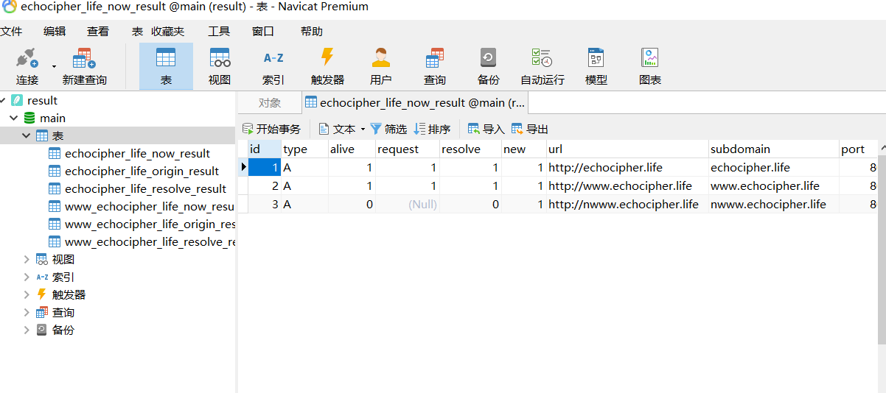

从上面代码可以看到我们通过`oneforall_results_sql()`函数完成了对`example_com_now_result`这张表的读取，我们可以通过在`autoearn.py`中调用来看到这一过程

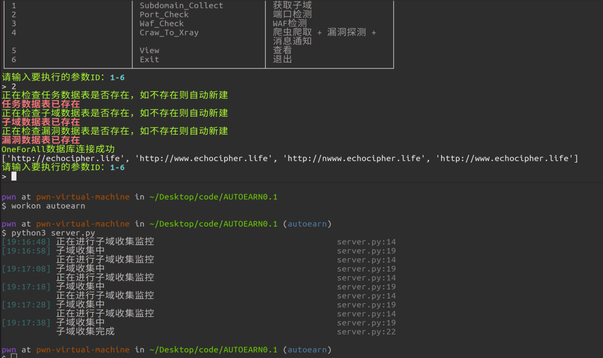

接下来我们又编写了`insert_subdomain_sql(url_result)`函数将我们上述读取到的结果插入到了`SUBDOMAIN`表中

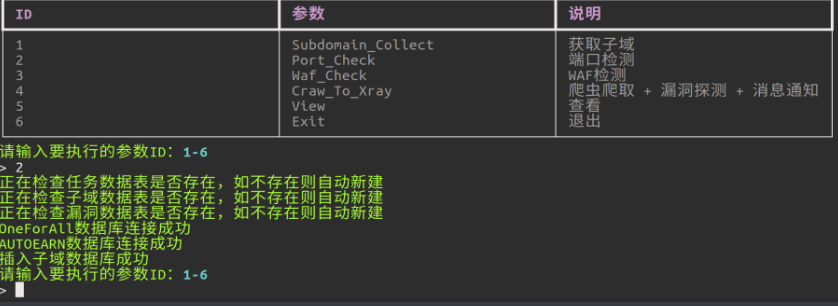

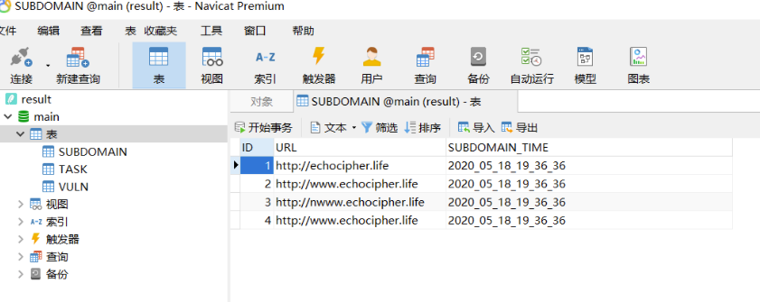

我们将子域收集克隆到数据库后，我们上面的`server`酱就可以完善一下了 ，我们可以让他在子域收集完成之后自动将`oneforall`的结果克隆到`SUBDOMAIN`表中，并且给我们发送通知的消息也可以更加完善了，比如一共收集到了多少个子域名等等信息，这里你可以根据自己的兴趣进行调整，同样的我们这里可以通过`read_subdomain_sql()`函数读取`SUBDOMAIN`表来计算其中子域数目，接下来我们就可以如下代码，读取其中的内容

```python
for i in (sql_connect.read_subdomain_sql()):
    print('ID:{0},URL:{1},TIME:{2}'.format(i[0],i[1],i[2]))
```

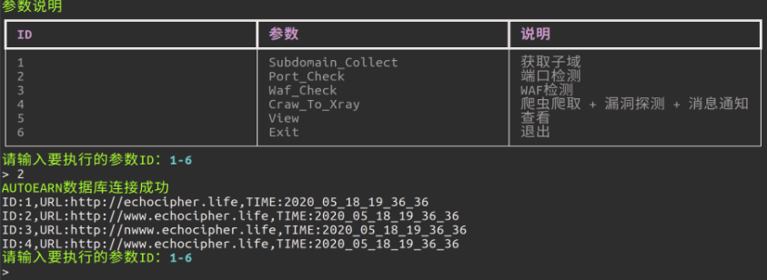

这里是为了方便我们之后在利用`flask`构造可视化界面时进行的数据获取，我们这里就先获取一个子域名数量，并且完善我们的`server酱`

### 优化子域收集通知

通过上面知道，我们已经可以通过

```python
sql_connect.task_sql_check()
sql_connect.subdomain_sql_check()
sql_connect.vuln_sql_check()
sql_connect.insert_subdomain_sql(sql_connect.oneforall_results_sql())
subdomain_num = len(sql_connect.read_subdomain_sql())
```

来获取子域收集数目，我们就可以在`server`酱推送的时候推送这一内容，而且`server`酱支持`Markdown`，我们可以好好构造一下这个内容，使得我们的通知更加美观一些

```python
# lib/server_push.py

import time
import requests
from lib import config, sql_connect
from rich.console import Console


console = Console()


# 子域收集状态提醒
def subdomain_status_push():
    console.log('子域收集完成')
    sql_connect.task_sql_check()
    sql_connect.subdomain_sql_check()
    sql_connect.vuln_sql_check()
    sql_connect.insert_subdomain_sql(sql_connect.oneforall_results_sql())
    subdomain_num = len(sql_connect.read_subdomain_sql())
    content = """``` 子域收集结束```
#### 结果:  共收集到了{subdomain_num}个子域
#### 发现时间: {now_time}
""".format(subdomain_num=subdomain_num, now_time=time.strftime("%Y_%m_%d_%H_%M_%S", time.localtime()))
    try:
        resp = requests.post(config.sckey,data={"text": "子域收集完成提醒", "desp": content})
    except:
        console.print('子域提醒失败，请检查sckey是否正确配置', style="bold red")
```

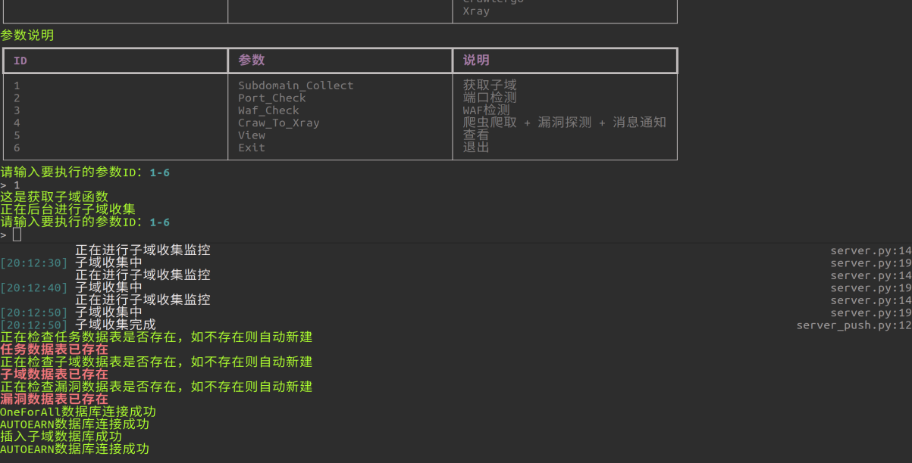

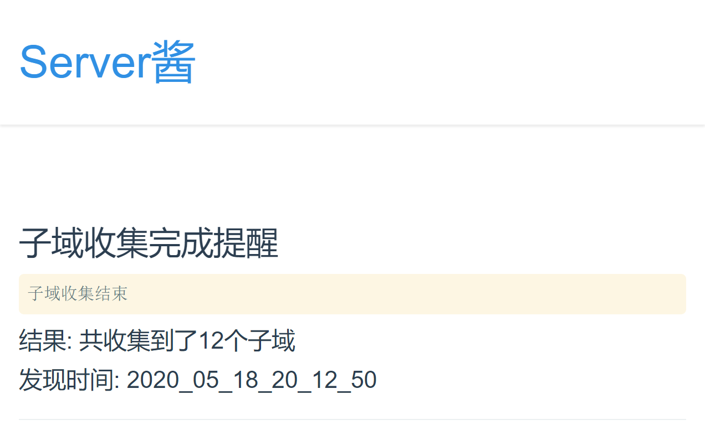

现在我们的`AUTOEARN`已经能够自行完成子域收集内容，并且在完成后发送微信通知，而且会自动复制一份到我们的`SUBDOMAIN`表中，至此我们基本的子域收集功能已经实现，如果想继续优化可以根据自身需求进行调整。

### 端口检测

端口检测也是我们信息收集中需要注意的一点，有很多`web`服务可能不仅仅部署在`80`以及`443`端口上，我们收集到的目标越多，发现风险的可能性越大，因此端口检测对于我们来说是一个很重要的部分，我们这里采取两种方式进行端口检测的样例，供大家参考

1. Masscan + Nmap
2. Shodan

在进行端口检测前，我们需要获取对应的`IP`，而且我们需要保证我们获取到的是真实`IP`，`CDN`的存在会干扰这一过程，所以我们在端口检测前要先进行判别网站是否存在`CDN`，如果存在则跳过端口检测的过程，判断`CDN`方式一般如下

1. 若能直接通过`ping`到的`ip`访问目标则未开启`CDN`
2. 多地`ping`，若开启`CDN`，则会返回多个`IP`
3. 查看`DNS`解析记录
4. 利用`ASN`信息关联来进行判断

具体相关内容大家可以自行搜索学习，这里不再赘述，但是要知道的是无论使用哪种方式都是存在误报的可能的，因此建议大家组合使用进行判断来尽量减少误报，这里我们作为样例，我们利用`socket`来获取相应的`IP`，如果返回的`IP`多于一个我们就认为它存在`CDN`，类似代码如下，这里需要注意的是，在`Linux`下`getaddrinfo`会返回`ipv6`地址从而影响我们的判断，因此我们需要进行相应的处理

```python
# lib/check_cdn.py

import socket
from rich.console import Console


console = Console()


# 判断CDN函数
def check_cdn(domain):
    ip_list = []
    try:
        console.print('正在进行CDN检测', style="#ADFF2F")
        addrs = socket.getaddrinfo(domain, None, family=0)
        for item in addrs:
            if item[4][0] not in ip_list:
                if item[4][0].count('.') == 3:
                    ip_list.append(item[4][0])
                else:
                    pass
        return ip_list
    except:
        console.print('CDN检测失败，请检查输入格式', style="bold red")
        pass
```

我们可以通过类似下面的代码进行判断是否存在`CDN`

```python
# 判断subdomain cdn
def subdomain_check_cdn():
    for domain in sql_connect.read_subdomain_sql():
        console.print('URL:{0},CDN:{1}'.format(domain[1],check_cdn(domain[1])), style="#ADFF2F")
```


我们会在端口扫描函数中进行相应的条件判断，根据目标是否存在`CDN`，来决定返回目标的格式，比如我们在程序中是如下设定的

1. 存在`CDN`：返回`Domain`的默认`80`端口
2. 不存在`CDN`：进行服务指纹识别，返回`协议:Domain:端口`

大家可以根据自身需要进行判断调整，接下来我们就可以进行我们的端口检测函数的编写了，首先以`Shodan`为例，我们可以利用`shodan` 获得相应的信息，详情可以查看[shodan文档](http://shodan.readthedocs.io/en/latest/tutorial.html)

```python
# lib/port_check.py

# shodan获取端口、服务
def shodan_port_check(ip,domain):
    url_list = []
    SHODAN_API_KEY = config.SHODAN_API_KEY
    api = shodan.Shodan(SHODAN_API_KEY)
    try:
        results = api.host(ip)
        ports = results['ports']
        datas = results['data']
        for data in datas:
            port = data['port']
            module = data['_shodan']['module']
            if 'http' in module:
                if 'https' in module:
                    url = 'https://' + domain + ':' + str(port)
                else:
                    url = 'http://' + domain + ':' + str(port)
                url_list.append(url)
    except:
        console.print('目标' + domain + '查询失败，已跳过', style="bold red")
    return url_list
```

在进行检测之前，我们可以利用`api.info()`来验证`api`是否正确，如果不正确则直接退出

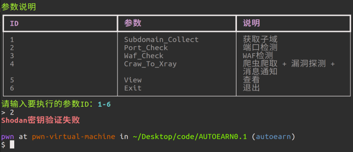

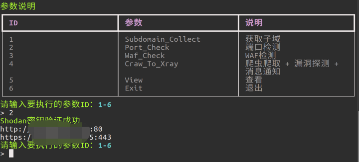

接下来我们说一下`masscan + nmap`，`硬糖`师傅曾经分享过这个`trick`，结合了两个工具的优点

nmap扫描准确，并且显示信息详细，但是速度太慢；masscan扫描快但是不会显示端口服务的相关信息，这里`masscan`和`nmap`的安装配置不再赘述，我们先梳理一下思路，思路大概就是我们先用速度较快的`masscan` 对目标进行`1-65535`全端口扫描，这里`masscan`的速率不建议设置太高，否则会提高`丢包率`，`masscan`扫描完成保存到相应的`json`文件中，之后我们从其中提取相应内容，然后再利用`nmap`识别服务信息，如果有`web`服务的我们就将结果保留，这其中`硬糖`师傅还提到了一个小技巧，就是我们有可能会遇到一些防护设备，比如不论我们探测哪个端口都会返回存活，这样就会产生一些脏数据，所以我们这里通过自定义一个阈值来绕过这一情况，比如我们设置为`50`，这样只要一个`ip`存活端口数目大于`50`我们就先将这个目标丢弃，具体代码实现如下

```python
# lib/port_check.py

# masscan端口检测函数
def masscan_port_check(ip):
    tmp_list = []
    url_list = []
    results_list = []
    console.print('正在进行端口探测', style="#ADFF2F")
    # cmd = ['sudo', config.masscan_path, ip, '-p', config.masscan_port, '-oJ', config.masscan_file, '--rate', config.masscan_rate]
    cmd = 'sudo ' + config.masscan_path + " " + ip + ' -p ' + config.masscan_port + ' -oJ ' +  config.masscan_file + ' --rate '+ config.masscan_rate
    rsp = subprocess.Popen(cmd, stdout=subprocess.PIPE, stderr=subprocess.PIPE, shell=True)
    while True:
        if rsp.poll() == None:
            pass
        else:
            break
    with open (config.masscan_file, 'r') as wr:
        for line in json.loads(wr.read()):
            ip = line['ip']
            port = line['ports'][0]['port']
            result_dict = {
                'ip':ip,
                'port':port
            }
            tmp_list.append(result_dict)
        if len(tmp_list) > config.port_num_max:
            tmp_list.clear()
        else:
            results_list.extend(tmp_list)
        for result in results_list:
            ip = result['ip']
            port = str(result['port'])
            url = service_check(ip,port)
            if len(url) > 0:
                url_list.append(url)
        return url_list


# service检测函数
def service_check(ip,port):
    url_list = []
    nm = nmap.PortScanner()
    ret = nm.scan(ip,port, arguments = '-Pn,-sS')
    service_name = ret['scan'][ip]['tcp'][int(port)]['name']
    if 'http' in service_name or service_name == 'sun-answerbook':
        if service_name == 'https' or service_name == 'https-alt':
            url = 'https://' + ip + ':' + port
        else:
            url = 'http://' + ip + ':' + port
        return url
```

接下来我们可以结合一下我们之前的`CDN`检测模块，实现我们说过的相关功能

```python
# lib/port_check.py

# 判断subdomain cdn
def subdomain_port_check():  
    url_list = []
    for domain in track(sql_connect.read_subdomain_sql()):
        try:
            if len(check_cdn.check_cdn(domain[1])) == 1:
                url_list.extend(shodan_port_check(check_cdn.check_cdn(domain[1])[0],domain[1]))
            else:
                console.print('目标存在CDN', style="bold red")
                url_list.append('http://'+domain[1])
        except:
            console.print('目标' + domain[1] + '查询异常', style="bold red")
    sql_connect.insert_task_sql(url_list)
```

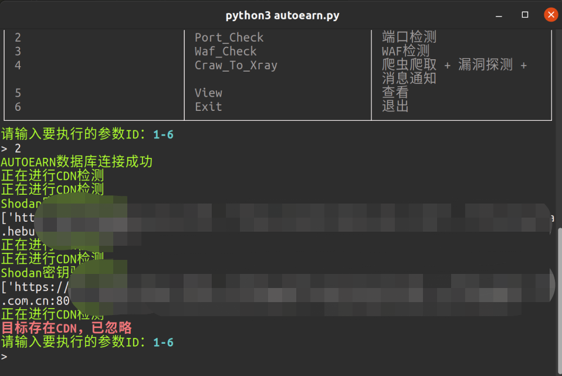

这里我们知道，全端口扫描同样是一个耗时的功能，因此我们可以通过多线程来加快我们的端口扫描速度，默认线程设置为`10`，要注意的是，当对全局资源存在写操作时，如果不能保证写入过程的原子性，会出现脏读脏写的情况，即线程不安全，`Python`的`GIL`只能保证原子操作的线程安全，因此在多线程编程时我们需要通过加锁来保证线程安全。

```python
# lib/port_check.py

import queue
import threading
import time

exitFlag = 0

class myThread (threading.Thread):
    def __init__(self, threadID, name, q):
        threading.Thread.__init__(self)
        self.threadID = threadID
        self.name = name
        self.q = q
    def run(self):
        console.print("开启线程：" + self.name, style="#ADFF2F")
        mul_subdomain_port_check(self.name, self.q)
        console.print("退出线程：" + self.name, style="#ADFF2F")


def mul_subdomain_port_check(threadName, q):
    url_list = []
    while not exitFlag:
        queueLock.acquire()
        if not workQueue.empty():
            domain = q.get()
            queueLock.release()
            try:
                if len(check_cdn.check_cdn(domain[1])) == 1:
                    url_list.extend(shodan_port_check(check_cdn.check_cdn(domain[1])[0],domain[1]))
                else:
                    console.print('目标存在CDN', style="bold red")
                    url_list.append('http://'+domain[1])
            except:
                console.print('目标' + domain[1] + '查询异常', style="bold red")
            console.print("%s processing %s" % (threadName, domain[1]), style="#ADFF2F")
        else:
            queueLock.release()
    sql_connect.insert_task_sql(url_list)

threadNum = config.port_check_thread_num
threadList = []
for th in range(threadNum):
    threadList.append("Thread-"+str(th))
domainList = sql_connect.read_subdomain_sql()
queueLock = threading.Lock()
workQueue = queue.Queue()
threads = []
threadID = 1

# 创建新线程
for tName in threadList:
    thread = myThread(threadID, tName, workQueue)
    thread.start()
    threads.append(thread)
    threadID += 1

# 填充队列
queueLock.acquire()
for domain in domainList:
    workQueue.put(domain)
queueLock.release()

# 等待队列清空
while not workQueue.empty():
    pass

# 通知线程是时候退出
exitFlag = 1

# 等待所有线程完成
for t in threads:
    t.join()
console.print('退出主线程', style="#ADFF2F")
```

这样我们就可以多线程的进行端口扫描的过程，速度有了一定的提升。

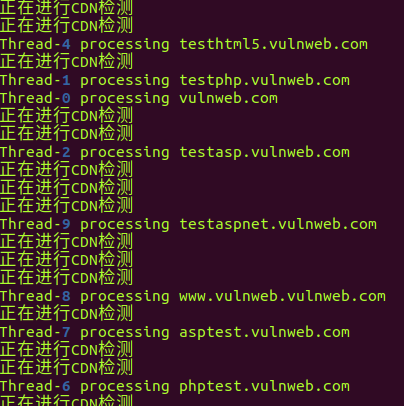

我们端口扫描完成后，得到的就是我们要进行`Fuzz`的`URL`列表，我们需要编写一个函数来将最终得到的`url`增加到`TASK`表中去

```python
# lib/sql_connect.py

# 插入TASK数据库
def insert_task_sql(url_result):
    task_conn = sqlite3.connect(config.result_sql_path)
    console.print('AUTOEARN数据库连接成功',style="#ADFF2F")
    task_c = task_conn.cursor()
    for url in url_result:
        now_time = time.strftime("%Y_%m_%d_%H_%M_%S", time.localtime())
        try:
            task_c.execute("INSERT INTO TASK (URL,TASK_TIME) VALUES ('%s', '%s')"%(url,now_time))
            task_conn.commit()
        except:
            console.print('插入任务数据库失败',style="bold red")
    console.print('插入任务数据库成功',style="#ADFF2F")
    task_conn.close()
```

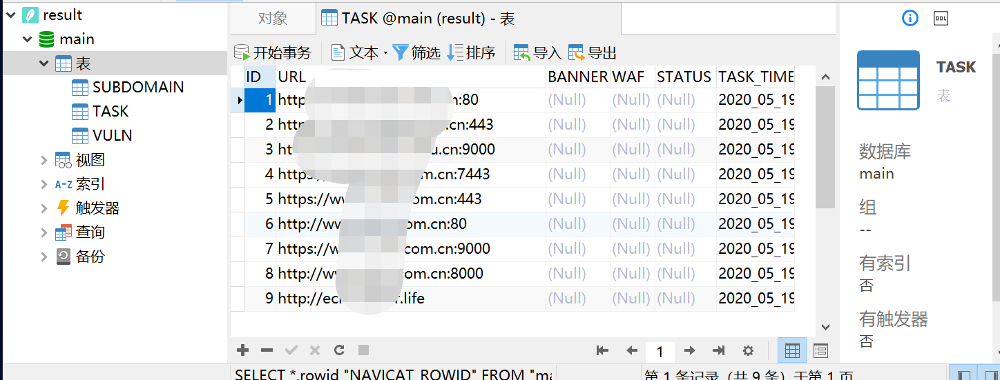

### Waf检测

我们可以通过[wafw00f](https://github.com/EnableSecurity/wafw00f)给我们的程序加入一个`waf`检测的功能，在这之前，我们需要写一个任务数据库读取的函数

```python
# lib/sql_connect.py

# 读取TASK数据库
def read_task_sql():
    task_conn = sqlite3.connect(config.result_sql_path)
    console.print('AUTOEARN数据库连接成功',style="#ADFF2F")
    task_c = task_conn.cursor()
    try:
        tasks = task_c.execute("select * from TASK").fetchall()
        return tasks
    except:
        console.print('读取任务数据库失败',style="bold red")
    console.print('读取任务数据库成功',style="#ADFF2F")
    task_conn.close()
```

接下来我们编写我们的`waf_check.py`

```python
# lib/waf_check.py

# WAF检测函数
def waf_check(domain_list):
    console.print('正在进行WAF检测',style="#ADFF2F")
    console.print('任务数据库连接成功',style="#ADFF2F")
    conn = sqlite3.connect(config.result_sql_path)
    c = conn.cursor()
    for domain in domain_list:
        domain = domain[1]
        cmd = ['python3', config.wafw00f_path, domain]
        rsp = subprocess.Popen(cmd, stdout=subprocess.PIPE, stderr=subprocess.PIPE)
        for i in (rsp.stdout.read().decode("GBK").split('\n')):
            if 'url' in i:
                url = json.loads(i.replace('\'', '\"'))['url']
                waf = json.loads(i.replace('\'', '\"'))['waf'][0]
                c.execute("UPDATE TASK set WAF = '%s' where URL = '%s' "%(waf, url))
                c.execute("UPDATE TASK set STATUS = 'WAF检测完成' where URL = '%s' "%(url,))
                conn.commit()
        while True:
            if rsp.poll() == None:
                pass
            else:
                break
    console.print('WAF检测完成',style="#ADFF2F")
    conn.close()
```

我们这里就以更改我们`TASK`表中的`STATUS`字段为例，你也可以按照自己的需求进行更改，比如我们文初说过的检测到`waf`则舍弃这个目标，这里不再赘述

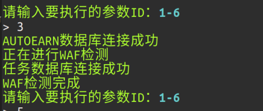

### Craw_To_Xray

终于到了我们最重要的地方，既然我们已经将目标放置到了`TASK`中，接下来就是我们利用`crawlergo`爬取目标并且发送到`xray` 了，我们首先在`crawlergo`查看一下它的命令参数

```
crawlergo 拥有灵活的参数配置，以下是详细的选项说明：

--chromium-path Path, -c Path chrome的可执行程序路径
--custom-headers Headers 自定义HTTP头，使用传入json序列化之后的数据，这个是全局定义，将被用于所有请求
--post-data PostData, -d PostData 提供POST数据，目标使用POST请求方法
--max-crawled-count Number, -m Number 爬虫最大任务数量，避免因伪静态造成长时间无意义抓取。
--filter-mode Mode, -f Mode 过滤模式，简单：只过滤静态资源和完全重复的请求。智能：拥有过滤伪静态的能力。严格：更加严格的伪静态过滤规则。
--output-mode value, -o value 结果输出模式，console：打印当前域名结果。json：打印所有结果的json序列化字符串，可直接被反序列化解析。none：不打印输出。
--incognito-context, -i 浏览器启动隐身模式
--max-tab-count Number, -t Number 爬虫同时开启最大标签页，即同时爬取的页面数量。
--fuzz-path 使用常见路径Fuzz目标，获取更多入口。
--robots-path 从robots.txt 文件中解析路径，获取更多入口。
--tab-run-timeout Timeout 单个Tab标签页的最大运行超时。
--wait-dom-content-loaded-timeout Timeout 爬虫等待页面加载完毕的最大超时。
--event-trigger-interval Interval 事件自动触发时的间隔时间，一般用于目标网络缓慢，DOM更新冲突时导致的URL漏抓。
--event-trigger-mode Value 事件自动触发的模式，分为异步和同步，用于DOM更新冲突时导致的URL漏抓。
--before-exit-delay 单个tab标签页任务结束时，延迟退出关闭chrome的时间，用于等待部分DOM更新和XHR请求的发起捕获。
--ignore-url-keywords 不想访问的URL关键字，一般用于在携带Cookie访问时排除注销链接。
--push-to-proxy 拟接收爬虫结果的监听地址，一般为被动扫描器的监听地址。
--push-pool-max 发送爬虫结果到监听地址时的最大并发数。
--log-level 打印日志等级，可选 debug, info, warn, error 和 fatal。
```

我们可以看到，我们可以将形如`xray`或者`w13scan`等代理扫描器的地址赋给`--push-to-proxy`

我们先启动`xray`

```shell
webscan --listen 127.0.0.1:7777 --html-output xray-testphp.html
```

之后编写我们的代码

```python
# lib/craw_to_xray.py

# 爬虫爬取并且发送到XRAY
def craw_to_xray(domain_list):
    console.print('正在进行爬虫探测+漏洞检测',style="#ADFF2F")
    console.print('任务数据库连接成功',style="#ADFF2F")
    conn = sqlite3.connect(config.result_sql_path)
    c = conn.cursor()
    for domain in domain_list:
        domain = domain[1]
        # cmd = [config.crawlergo_path, "-c", config.chrome_path,"-t",config.max_tab_count, "-f", "smart", "--fuzz-path", "--push-to-proxy",config.push_to_proxy,  "--push-pool-max", config.max_send_count, domain]
        cmd = config.crawlergo_path + " -c " + config.chrome_path + " -t " + config.max_tab_count + " -f " + " smart " + " --fuzz-path " + " --push-to-proxy " + config.push_to_proxy + " --push-pool-max " + config.max_send_count + " " + domain 
        # rsp = subprocess.Popen(cmd, stdout=subprocess.PIPE, stderr=subprocess.PIPE, shell=True)
        console.print('即将开启爬虫模块，可通过[bold cyan]tail -f logs/xray.log[/bold cyan]查看进度信息',style="#ADFF2F")
        rsp = subprocess.Popen(cmd, shell=True)
        while True:
            if rsp.poll() == None:
                pass
            else:
                break
```

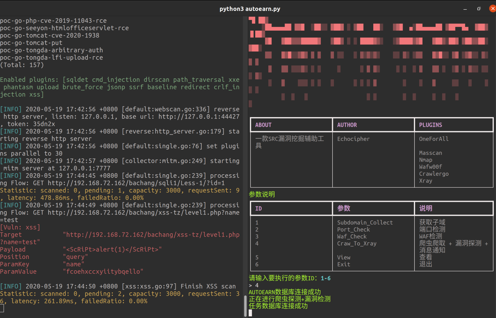

这时候启动我们已经可以看到我们`TASK`中的目标已经经过`crawlergo`发送给`xray`了，接下来就是我们要继续完成最后一部分了，就是我们发现漏洞后的通知提醒以及本地数据库的留存，通过[xray文档](https://xray.cool/xray/#/tutorial/introduce)我们知道` xray` 有一种漏洞输出模式叫``webhook-output`，在发现漏洞的时候，将会向指定的` url `通过`post` 漏洞数据，那么我们很容易结合之前的`flask`以及`server`酱来完成漏洞通知

```python
# server.py

app = Flask(__name__)


def push_ftqq(content):
    resp = requests.post(config.sckey,
                  data={"text": "AUTO EARN漏洞提醒", "desp": content})
    if resp.json()["errno"] != 0:
        raise ValueError("push ftqq failed, %s" % resp.text)

@app.route('/webhook', methods=['POST'])
def xray_webhook():
    vuln = request.json
    # 因为还会收到 https://chaitin.github.io/xray/#/api/statistic 的数据
    if "vuln_class" not in vuln:
        return "ok"
    content = """```xray 发现了新漏洞```
### url: {url}
### 插件: {plugin}
### 漏洞类型: {vuln_class}
### 发现时间: {create_time}
​```请及时查看和处理```
""".format(url=vuln["target"]["url"], plugin=vuln["plugin"],
           vuln_class=vuln["vuln_class"] or "Default",
           create_time=str(datetime.datetime.fromtimestamp(vuln["create_time"] / 1000)))
    try:
        push_ftqq(content)
        sql_connect.insert_vuln_sql(vuln)
    except Exception as e:
        logging.exception(e)
    return 'ok'


if __name__ == '__main__':
    app.run(
        port=2333,
        debug=True
    )
```

我们只需要将之前启动`xray`的代码修改成

```bash
./tools/xray/xray_linux_amd64 webscan --listen 127.0.0.1:7777 --webhook-output http://127.0.0.1:2333/webhook
```

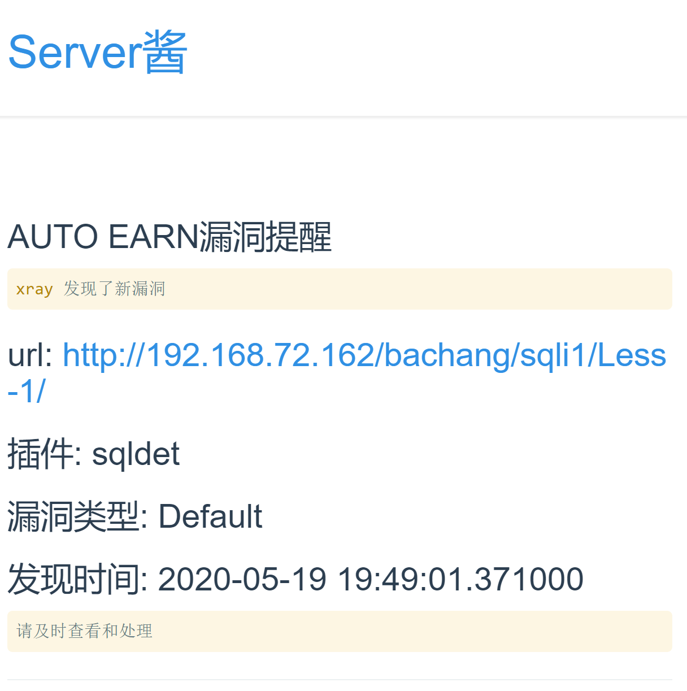

接下来还有一个问题就是数据库备份的问题，我们之前也为数据库做了相应的表和字段，这样我们存储到数据库中，不仅可能会避免因为网络可能会产生问题导致我们没能看到相应的漏洞详情

```python
# lib/sql_connect.py

# 插入漏洞数据库
def insert_vuln_sql(vuln):
    vuln_conn = sqlite3.connect(config.result_sql_path)
    console.print('漏洞数据库连接成功',style="#ADFF2F")
    vuln_c = vuln_conn.cursor()
    url=vuln["target"]["url"]
    plugin=vuln["plugin"]
    vuln_class=vuln["vuln_class"]
    create_time=str(time.strftime("%Y_%m_%d_%H_%M_%S", time.localtime()))
    vuln_list = [url ,plugin ,vuln_class, create_time]
    query = "INSERT INTO VULN (URL,PLUGIN,CLASS,VULN_TIME ) VALUES (?,?,?,?)"
    vuln_c.execute(query, vuln_list)
    vuln_conn.commit()
    vuln_conn.close()   
```

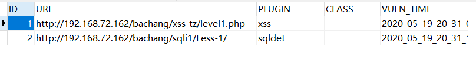

至此，我们已经能够联动我们前面的模块，进行`子域收集`、`端口检测`、`漏洞探测`、`通知提醒`以及`数据库备份`了，接下来我们就是构造一个前端页面来进行前端展示的过程

### 前端展示

我们之前已经完成了微信通知以及数据库的操作，那么我们可以不可以构造一个可视化界面呢？这样我们就不需要每次都去`Windows`下利用`Navicat`查看数据库中的内容了，答案是肯定的，我们可以利用`flask`完成这样一个界面，我们可以构建一个`app.py`

```python
app = Flask(__name__)
DATABASE = config.result_sql_path


@app.route('/')
def index():
    # 获取子域数据
    result_list = []
    conn = sqlite3.connect(DATABASE)
    cur = conn.cursor()
    sql = "SELECT * FROM SUBDOMAIN"
    cur.execute(sql)
    subdomains = cur.fetchall()
    task_sql = "SELECT * FROM TASK"
    cur.execute(task_sql)
    tasks = cur.fetchall()
    vul_sql = "SELECT * FROM VULN"
    cur.execute(vul_sql)
    vuls = cur.fetchall()
    plugin_list = []
    s = set()
    result_list = []
    for vuln in vuls:
        plugin_list.append(vuln[2])
    for plugins in plugin_list:
        if plugins not in s:
            s.add(plugins)
            result = {
                'name': plugins,
                'value': plugin_list.count(plugins)
            }
            result_list.append(result)
    # 分页
    PER_PAGE = config.PER_PAGE #每页展示条数
    total = len(subdomains)
    page = int(request.args.get('page', 1))
    start = (page - 1) * PER_PAGE
    end = start + PER_PAGE
    paginate = Pagination(bs_version=4 ,page=page ,total=total, per_page = PER_PAGE)
    task_total = len(tasks)
    task_paginate = Pagination(bs_version=4 ,page=page ,total=task_total, per_page = PER_PAGE)
    tasks = tasks[start:end]
    subdomain = subdomains[start:end]
    vuls_total = len(vuls)
    vuls_paginate = Pagination(bs_version=4 ,page=page ,total=vuls_total, per_page = PER_PAGE)
    vuls = vuls[start:end]
    return render_template('index.html', paginate=paginate, subdomain=subdomain, tasks=tasks, task_paginate=task_paginate,vuls=vuls, vuls_paginate=vuls_paginate, vuls_total=vuls_total, result_list=result_list)   
  
  if __name__ == '__main__':
    app.run(host='0.0.0.0',  debug=True)
```

这样我们就通过`flask`查询了相应`子域收集`、`任务列表`、`漏洞详情`的相关信息，而且利用`paginate`做了分页处理，接下来我们构造一个`lib/run_html.py`来运行`app.py`

```
# lib/run_html.py

import subprocess


def main():
    cmd = ['python3', 'app.py']
    rsp = subprocess.Popen(cmd)
    while True:
        if rsp.poll() == None:
            pass
        else:
            break
```

这两个核心文件写完之后我们可以简单的写一个`templates/index.html`来从数据库中取出数据，并且反馈到前端，我们这里利用`bootstrap`来方便我们前端的编写，以`子域详情`为例

```python
	<!-- 子域详情 -->
				<div> 
					<div class="panel-heading">
						<h3 class="panel-title">
							<span class="label label-info">子域详情</span>
						</h3>
					</div>
					<div class="panel-body">
						<table class="table table-hover" style="word-break:break-all; word-wrap:break-all;">
							<thead>
								<tr>
									<th>ID</th>
									<th>URL</th>
									<th>TIME</th>
								</tr>
							</thead>
							<tbody>
								
									<tr>
										<td>{{ domain[0] }}</td>
										<td>{{ domain[1] }}</td>
										<td>{{ domain[2] }}</td>
									</tr>
								
							</tbody>
						</table>
						<div>
							{{ paginate.links }}
						</div>
					</div>
				</div>
```

我们一定要记住新建`templates`文件夹作为我们的模板文件夹，再将`index.html`放进去，接下来就是让我们的`autoearn.py` 加入这一功能

```python
# autoearn.py

...
        elif args == '5':
            run_html.main()
```

接下来我们在访问`IP:5000`即可发现我们已经完成了将数据库中的内容反应到前端

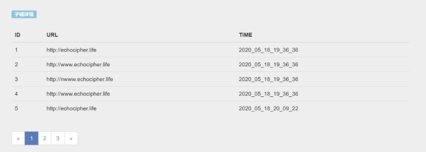

接下来我们为了方便的统计自己的收获，可以通过`饼状图`的可视化过程来完成更好的显示，这里我选择了`Echarts`来实现我的目标

```
ECharts，一个使用 JavaScript 实现的开源可视化库，可以流畅的运行在 PC 和移动设备上，兼容当前绝大部分浏览器（IE8/9/10/11，Chrome，Firefox，Safari等），底层依赖矢量图形库 ZRender，提供直观，交互丰富，可高度个性化定制的数据可视化图表
```

我们可以通过[官方文档](https://echarts.apache.org/zh/tutorial.html#5 分钟上手 ECharts)来获取它的使用方法，我们可以看到我们可以用以下几种方式获取它

1. 从[Apache ECharts (incubating)](https://echarts.apache.org/download.html) 官网下载界面 获取官方源码包后构建。
2. 在`ECharts`的[GitHub](https://github.com/apache/incubator-echarts/releases) 获取。
3. 通过 `npm` 获取 `echarts`，`npm install echarts --save`，详见[在webpack中使用echarts](https://echarts.apache.org/tutorial.html#在 webpack 中使用 ECharts)
4. 通过 [jsDelivr](https://www.jsdelivr.com/package/npm/echarts)等`CDN`引入

我们这里就采用最方便的`CDN`方式使用吧

```html
<script src="https://cdn.jsdelivr.net/npm/echarts@4.7.0/dist/echarts.min.js"></script>
```

通过官方文档我们知道，我们想创造一个`饼状图`，只需要在页面中添加如下代码即可

```html
 <div id="main" style="width: 600px;height:400px;"></div>
    <script>
        // 绘制图表。
        echarts.init(document.getElementById('main')).setOption({
            series: {
                type: 'pie',
                data: [
                    {name: 'A', value: 1212},
                    {name: 'B', value: 2323},
                    {name: 'C', value: 1919}
                ]
            }
        });
    </script>
```

这里我们打开页面，发现我们已经得到了我们想要的饼状图

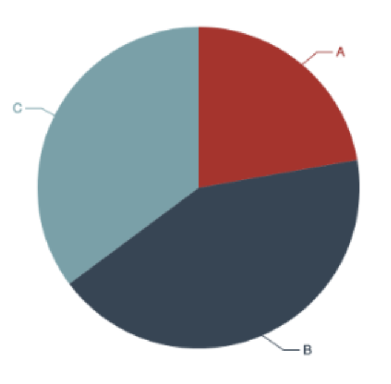

我们仔细观察一下`Echarts`中我们需要修改的部分为：

```html
data: [
    {name: 'A', value: 1212},
    {name: 'B', value: 2323},
    {name: 'C', value: 1919}
]
```

因此我们只要在`app.py`中构造一个列表即可，大家可以通过上述代码进行查阅，此时我们配合的前端页面应该为

```html
# /templates/index.html

<!DOCTYPE html>
<html>
<head>
	<meta charset="utf-8"> 
	<title>AUTO EAEN : 一款SRC辅助工具</title>
	<link rel="stylesheet" href="https://cdn.staticfile.org/twitter-bootstrap/3.3.7/css/bootstrap.min.css">  
	<script src="https://cdn.staticfile.org/jquery/2.1.1/jquery.min.js"></script>
	<script src="https://cdn.staticfile.org/twitter-bootstrap/3.3.7/js/bootstrap.min.js"></script>
	<script src="https://cdn.jsdelivr.net/npm/echarts@4.7.0/dist/echarts.min.js"></script>
</head>
<body>
	<div class="panel panel-default">
		<div class="container">
			<div class="jumbotron">
				<h1>AUTO EARN</h1>
				<h2>”三五之夜,明月半墙,桂影斑驳,风移影动,珊珊可爱。“</h2>
				<hr>
				<div>
					<div class="panel-body">
				        <div id="main" style="width: 600px;height:400px;"></div>
						<script type="text/javascript">
							// 基于准备好的dom，初始化ECharts实例
							
							var myChart = echarts.init(document.getElementById('main'));

							// 指定图表的配置项和数据
							var option = {
							    title: {
							        text: '漏洞数据总览',
							        left: 'center'
							    },
							    tooltip: {
							        trigger: 'item',
							        formatter: '{a} <br/>{b} : {c} ({d}%)'
							    },
							    series: [
							        {
							            name: '漏洞类型',
							            type: 'pie',
							            radius: '55%',
							            center: ['50%', '60%'],
							            data: {{ result_list }},
							            emphasis: {
							                itemStyle: {
							                    shadowBlur: 10,
							                    shadowOffsetX: 0,
							                    shadowColor: 'rgba(0, 0, 0, 0.5)'
							                }
							            }
							        }
							    ]
							};
							// 使用刚指定的配置项和数据显示图表。
							myChart.setOption(option);
							myChart.currentIndex = -1;

							setInterval(function () {
							    var dataLen = option.series[0].data.length;
							    // 取消之前高亮的图形
							    myChart.dispatchAction({
							        type: 'downplay',
							        seriesIndex: 0,
							        dataIndex: myChart.currentIndex
							    });
							    myChart.currentIndex = (myChart.currentIndex + 1) % dataLen;
							    // 高亮当前图形
							    myChart.dispatchAction({
							        type: 'highlight',
							        seriesIndex: 0,
							        dataIndex: myChart.currentIndex
							    });
							    // 显示 tooltip
							    myChart.dispatchAction({
							        type: 'showTip',
							        seriesIndex: 0,
							        dataIndex: myChart.currentIndex
							    });
							}, 1000);
						
						</script>
				            <p style="font-family: 楷体;font-size: 16pt;font-weight: bold">当前漏洞总数：{{ vuls_total }}</p>
				            <hr>
				        </div>
				    </div>
			    <hr>
				<!-- 子域详情 -->
				<div> 
					<div class="panel-heading">
						<h3 class="panel-title">
							<span class="label label-info">子域详情</span>
						</h3>
					</div>
					<div class="panel-body">
						<table class="table table-hover" style="word-break:break-all; word-wrap:break-all;">
							<thead>
								<tr>
									<th>ID</th>
									<th>URL</th>
									<th>TIME</th>
								</tr>
							</thead>
							<tbody>
								
									<tr>
										<td>{{ domain[0] }}</td>
										<td>{{ domain[1] }}</td>
										<td>{{ domain[2] }}</td>
									</tr>
								
							</tbody>
						</table>
						<div>
						</div>
					</div>
				</div>
				<!-- 任务详情 -->
				<div> 
					<div class="panel-heading">
						<h3 class="panel-title">
							<span class="label label-info">任务详情</span>
						</h3>
					</div>
					<div class="panel-body">
						<table class="table table-hover" style="word-break:break-all; word-wrap:break-all;">
							<thead>
								<tr>
									<th>ID</th>
									<th>URL</th>
									<th>WAF</th>
									<th>STATUS</th>
									<th>TIME</th>
								</tr>
							</thead>
							<tbody>
								
									<tr>
										<td>{{ task[0] }}</td>
										<td>{{ task[1] }}</td>
										<td>{{ task[3] }}</td>
										<td>{{ task[4] }}</td>
										<td>{{ task[5] }}</td>
									</tr>
								
							</tbody>
						</table>
						<div>
						</div>
					</div>
				</div>
				<!-- 漏洞详情 -->
				<div> 
					<div class="panel-heading">
						<h3 class="panel-title">
							<span class="label label-info">漏洞详情</span>
						</h3>
					</div>
					<div class="panel-body">
						<table class="table table-hover" style="word-break:break-all; word-wrap:break-all;">
							<thead>
								<tr>
									<th>ID</th>
									<th>URL</th>
									<th>PLUGIN</th>
									<th>CLASS</th>
									<th>TIME</th>
								</tr>
							</thead>
							<tbody>
								
									<tr>
										<td>{{ vul[0] }}</td>
										<td>{{ vul[1] }}</td>
										<td>{{ vul[2] }}</td>
										<td>{{ vul[3] }}</td>
										<td>{{ vul[4] }}</td>
									</tr>
								
							</tbody>
						</table>
						<div>
							{{ paginate.links }}
						</div>
					</div>
				</div>
				<div>
					<h3 class="footer-title">本系统禁止进行未授权、非法渗透测试</h3>
					<p>请使用者遵守当地相关法律，勿用于非授权测试，如作他用所承受的法律责任一概与作者无关，下载使用即代表使用者同意上述观点。
					<br/>
					详情请访问: <a href="http://www.npc.gov.cn/npc/xinwen/2016-11/07/content_2001605.htm" target="_blank">《中华人民共和国网络安全法》</a>
					</p>
				</div>
			</div>
		</div>
	</div>
</body>


</html>
```

这里有一个注意的点是当我们完成上面内容的时候是无法看到我们的`饼图`的，我们右键查看一下源码发现：

```html
<div id="main" style="width: 600px;height:400px;"></div>
       <script>
        // 绘制图表。

        echarts.init(document.getElementById('main')).setOption({
            series: {
                type: 'pie',
                
                
                
                
                
                data: [{&#x27;name&#x27;: &#x27;SQL注入&#x27;, &#x27;value&#x27;: 3}, {&#x27;name&#x27;: &#x27;XSS&#x27;, &#x27;value&#x27;: 1}, {&#x27;name&#x27;: &#x27;未授权访问&#x27;, &#x27;value&#x27;: 1}, {&#x27;name&#x27;: &#x27;SSRF&#x27;, &#x27;value&#x27;: 1}]
            }
        });

       </script>
   </div>
```

我们发现我们的数据虽然成功获取到了，但是被转义了，这是因为模板默认会对`模板变量`进行转义，因此`Echarts`没有接收到正确的数据，无法正常显示，因此我们只需要将关闭这一过程即可，方法也比较简单，我们只需要在模板中使用``标签即可，上述代码中已经修改好了，接下来看看我们的前端吧


动态效果可以访问：https://echocipher.life/autoearn.html 进行查看

### 启动/停止脚本

我们到现在已经完成了我们开始的所有功能，我们注意到我们如果想要使用这个功能我们需要完成以下几部分内容

1. 通过`subdomain_monitor.py`监控子域收集进程来进行消息提醒
2. 启动`server.py`来完成漏洞通知提醒
3. 启动`xray`来进行漏洞探测

手动启动起来未免有些繁琐，我们可以通过`shell`脚本来完成这一过程，停止过程同理

```bash
# start.sh

chmod +x ./tools/crawlergo
chmod +x ./tools/xray/xray_linux_amd64 
nohup python3 server.py > logs/server.log 2>&1 &
nohup ./tools/xray/xray_linux_amd64 webscan --listen 127.0.0.1:7777 --webhook-output http://127.0.0.1:2333/webhook > logs/xray.log 2>&1 &
nohup python3 subdomain_monitor.py > logs/subdomain_monitor.log 2>&1 &

# stop.sh

ps -ef |grep python3 |awk '{print $2}'|xargs kill -9
ps -ef |grep xray |awk '{print $2}'|xargs kill -9
mv ./results/result.sqlite3 ./results/$(date "+%Y%m%d%H%M%S")_result.sqlite3
rm -rf ./tools/OneForAll/results/*
```

这样，我们就可以完整的完成了一个利用`OneForAll`进行子域收集、`Shodan API`端口扫描、`Xray`漏洞`Fuzz`、`Server酱`通知提醒的自动化漏洞扫描、即时通知提醒的漏洞挖掘辅助工具，完整代码参见：https://github.com/Echocipher/AUTO-EARN

### Docker镜像

我们的工具完成之后，为了之后处理每次更换系统配置环境的情况，我们可以部署一个我们自己的`Docker`镜像方便之后的使用，这里`Docker`的相关安装配置不在赘述，我们首先规定一下部署的系统，我们这里以`centos`为例，首先拉取一个纯净的`centos`镜像

```bash
docekr search centos
docekr pull centos
```

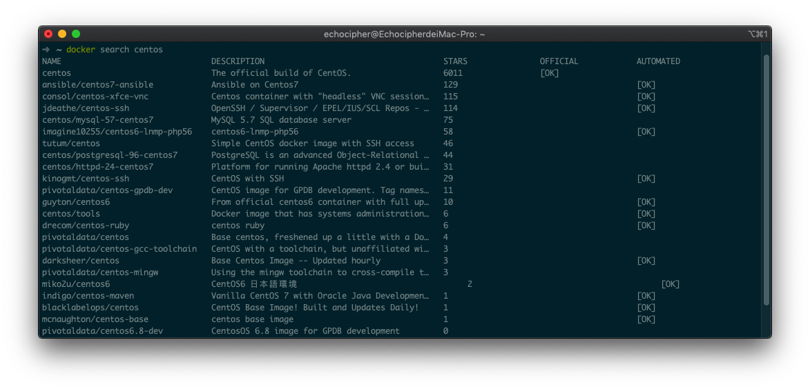

接下来我们查看一下本地镜像

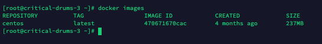

之后我们就可以创建并进入容器

```bash
# 创建容器
docker  run  -dit  --name=容器名  镜像 id  /bin/bash　　
# 查看所有容器
docker ps -a
# 进入容器
docker  exec  -it  容器名  /bin/bash　
```

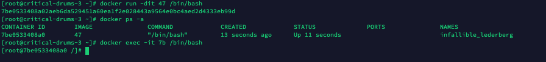

现在我们就进入了容器内部，接下来就是常规的环境配置

```bash
# 安装wget
yum install -y wget
# 安装python3
wget https://www.python.org/ftp/python/3.8.1/Python-3.8.1.tgz
tar -zxvf Python-3.8.1.tgz
cd Python-3.8.1
yum -y install libffi-devel zlib-devel bzip2-devel openssl-devel ncurses-devel sqlite-devel readline-devel tk-devel gcc make
./configure
make && make install
# 安装chrome
cd /etc/yum.repos.d/
vi google-chrome.repo
# 将以下内容写入文件
[google-chrome]
name=google-chrome
baseurl=http://dl.google.com/linux/chrome/rpm/stable/$basearch
enabled=1
gpgcheck=1
gpgkey=https://dl-ssl.google.com/linux/linux_signing_key.pub
# 安装chrome
yum -y install google-chrome-stable --nogpgcheck
```

安装完`chrome`，我们可以通过如下命令检查是否安装成功

```bash
google-chrome -version
```


接下来我们基础环境就算是搭建完成了，我们开始部署我们的`autoearn`

```bash
yum install -y git
git clone https://github.com/Echocipher/AUTO-EARN
cd AUTO-EARN/
python3 -m pip install -U pip setuptools wheel -i https://mirrors.aliyun.com/pypi/simple/
pip3 install -r requirements.txt -i https://mirrors.aliyun.com/pypi/simple/
```

这里我们就已经部署完成了，需要注意的是，我们的`chrome`的安装路径为`/usr/bin/google-chrome`，记得对应修改`lib/config.py`即可，接下来我们需要配置一下`xray`的证书

```bash
chmod +x ./tools/xray/xray_linux_amd64 
./tools/xray/xray_linux_amd64 genca
cp ca.crt /etc/pki/ca-trust/source/anchors/ca.crt
/bin/update-ca-trust
```

之后我们对应[相关文档](https://github.com/Echocipher/AUTO-EARN#%E7%9B%B8%E5%85%B3%E9%85%8D%E7%BD%AE)进行配置即可，接下来我们就要讲我们的容器制作成镜像了

```bash
# 退出容器
exit
# 制作镜像
docker  commit  -m  '镜像描述'  -a  '制作者'  容器名  镜像名
```

制作完成后我们可以用`docker images`查看到相应镜像


接下来我们需要注册自己的`dockerhub`账号，注册地址：[https://hub.docker.com](https://hub.docker.com/)，之后在`linux`服务器登录自己的账号：

```
docker login
```

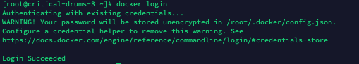

之后我们需要按照`Docker ID/仓库名`给镜像命名

```bash
docker tag 镜像ID Docker ID/仓库名:新的标签名(tag)
```

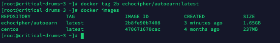

之后我们上传镜像到`hub`仓库即可

```bash
docker push echocipher/autoearn:latest
```

至此我们的`Docker`镜像也已经制作上传完毕

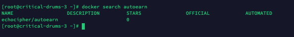

## 扫描样例


本次扫描样例来自于[vulnweb](https://github.com/Echocipher/AUTO-EARN/blob/master/vulnweb.com)，动态结果展示可访问：https://www.echocipher.life/autoearn.html

## 备注

因为是一个`样例版本`，因此代码中很多地方只是举了一两个例子，欠缺部分还很多，比如，高并发方面没有做出太好的调整，过分依赖`爬虫`效果以及`被动扫描器`的扫描规则，对于一些逻辑漏洞没有行之有效的判断方法，信息收集也是很粗糙，值得深入研究细化每一个小小的部分都可以拿出来当作一个专门要去学习和深究的方向，还希望可以抛砖引玉，看到师傅们更高的产出，没有什么太大的成就，只是站在了巨人的肩膀上，做出了一点微不足道的学习。

如果您也有什么想法或者建议，可以联系`echocipher#163.com`，期待与您交流

## 参考资源

1. [OneForAll](https://github.com/shmilylty/OneForAll)
2. [xray](https://github.com/chaitin/xray)
3. [crwlergo](https://github.com/0Kee-Team/crawlergo)
4. [server酱](http://sc.ftqq.com/)
5. [wafw00f](https://github.com/EnableSecurity/wafw00f)
6. [shodan](https://www.shodan.io/?language=en)
7. [国内SRC漏洞挖掘经验和技巧分享](https://www.ichunqiu.com/open/63178?t=1532058863)

